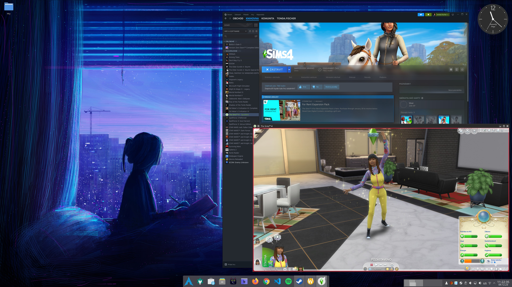

# games-steam-proton

```table-of-contents
```

## Games on Linux

In recent years, Linux has become increasingly popular as an operating system for gaming, thanks to its improved support and powerful tools. One of the best examples of this trend is Arch Linux and particularly its derivative - CachyOS. CachyOS, an architecture based on Arch Linux, is specially designed to enhance gaming performance and efficiency, making Linux an excellent platform for avid gamers.

This article will provide a comprehensive guide on how to leverage the full potential of Linux for gaming, focusing on Steam and Proton. Steam is a popular platform for game distribution, while Proton, a tool developed by Valve, enables running Windows-designed games on Linux. Together, these tools form a strong duo for playing almost any game on Linux.

As an example, we will take the popular game Sims 4, which is interesting not only for its integration on Steam but also for its connection with the EA platform. We will show you how to set up and optimize Sims 4 on the Arch Linux system, with recommendations from CachyOS, to give you the best possible gaming experience.

So let's dive into the world of Linux gaming and discover how you can utilize the strengths of Linux to play your favorite games!

## Important Links

### List of Games

Gaming on Linux is more diverse than many think. Check out the list of compatible games, including those that run directly on Linux or through various compatibility layers like Wine or Proton.

* https://wiki.archlinux.org/title/List_of_games

### Gaming Documentation

To learn more about how to optimize your gaming experience on Linux, visit these links. They contain valuable information about setting up games, using Proton, and other useful tips.

* https://wiki.archlinux.org/title/gaming
* https://wiki.archlinux.org/title/Steam#Proton_Steam-Play

### CachyOS Gaming

CachyOS is optimized for gaming. On this page, you can find information about how to maximize game performance on this system.

* https://wiki.cachyos.org/general_info/gaming/

### CachyOS Profiles

For detailed hardware settings according to the needs of your games, you can use various profiles available on GitHub. These profiles will help you set up graphics cards and other components for optimal performance. You can set up the basic pure Arch according to these variants or use CachyOS.

* https://github.com/CachyOS/chwd-db/blob/master/pci/graphic_drivers/profiles.toml

## Steam & Proton...Sims4

This detailed guide will take you through the process of setting up Steam and Proton on Arch Linux system (inspired by CachyOS) for playing Sims 4, including hardware optimization and troubleshooting common issues. The game Sims 4 was chosen not only for its integration with the Steam platform but also for its connection with the EA platform, making it a longstanding popular game.

### Step 1: System Preparation

Before installing Steam, it's important to ensure that your system is correctly configured. This includes enabling the multilib repository in `pacman.conf` to support 32-bit applications. This can be done by editing the `/etc/pacman.conf` file and uncommenting the lines `[multilib]` and `Include = /etc/pacman.d/mirrorlist`.

### Step 2: Installing Steam

Install Steam using the command `sudo pacman -S steam`. After installation, make sure you have the latest version and that all necessary dependencies are installed.

### Step 3: Activating Proton in Steam

After installing Steam, activate Proton in the Steam client. This will allow running Windows games on your Linux system. In the Steam settings, go to the "Compatibility" section, check 'Enable all' in the given window, and in the lower section, choose the Proton version you will use, e.g., Proton Experimental.

For more detailed information, see [Gaming CachyOS](https://wiki.cachyos.org/general_info/gaming/).

### Step 4: Installing Graphics Drivers and Choosing a Profile

To maximize the performance of your system, it is important to have the correct graphics drivers installed. On [CachyOS GitHub](https://github.com/CachyOS/chwd-db/blob/master/pci/graphic_drivers/profiles.toml), you can find various profiles for graphics drivers. Choose the profile that best matches your hardware and follow the instructions for installing and configuring the drivers.

For pure Arch Linux, select the appropriate section for your graphics card and install the specified drivers.

### Step 5: Installing and Launching Sims 4

Now you can proceed to install Sims 4 via Steam. After installing the game, you can launch it directly in the Steam client, and thanks to Proton, it should run without any issues.

### Step 6: Troubleshooting Common Issues

If you encounter problems such as poor performance or graphical errors, it might be useful to visit the [gaming section on Arch Wiki](https://wiki.archlinux.org/title/gaming) and [gaming section on CachyOS Wiki](https://wiki.cachyos.org/general_info/gaming/) for tips and tricks on how to solve these issues.

## Summary

By following these steps, you can enjoy playing Sims 4 and many other games on your Linux system with excellent performance. Remember, each hardware configuration is unique, and you may need to experiment with different settings and drivers to achieve the best possible result.



---

# Český originál článku

## Hry na Linuxu

V posledních letech se Linux stává stále populárnějším operačním systémem pro hraní her, díky jeho vylepšené podpoře a výkonným nástrojům. Jedním z nejlepších příkladů tohoto trendu je Arch Linux a zejména jeho odnož - CachyOS. CachyOS, architektura založená na Arch Linuxu, je speciálně navržena pro zvýšení herního výkonu a efektivity, což dělá z Linuxu skvělou platformu pro vášnivé hráče.

Tento článek poskytne ucelený návod, jak využít plný potenciál Linuxu pro hraní her, se zaměřením na Steam a Proton. Steam je oblíbená platforma pro distribuci her, zatímco Proton, nástroj vyvinutý Valve, umožňuje spouštění her určených pro Windows i na Linuxu. Spolu tvoří tyto nástroje silný tandem pro hraní téměř jakékoléž hry na Linuxu.

Jako příklad si vezmeme populární hru Sims 4, která je zajímavá nejen svou integrací na Steamu, ale i propojením s EA platformou. Ukážeme, jak nastavit a optimalizovat hru Sims 4 na systému Arch Linux, s doporučením z CachyOS, abyste získali nejlepší možný herní zážitek.

Pojďme se tedy ponořit do světa Linuxového gamingu a objevit, jak můžete využít silné stránky Linuxu pro hraní vašich oblíbených her!

## Důležité odkazy

### Seznam her

Hraní her na Linuxu je rozmanitější, než si mnozí myslí. Prohlédněte si seznam kompatibilních her, včetně těch, které běží přímo na Linuxu nebo prostřednictvím různých kompatibilních vrstev jako je Wine nebo Proton.

* https://wiki.archlinux.org/title/List_of_games

### Herní dokumentace

Chcete-li se dozvědět více o tom, jak optimalizovat váš herní zážitek na Linuxu, navštivte tyto odkazy. Obsahují cenné informace o nastavení her, používání Protonu a další užitečné tipy.

* https://wiki.archlinux.org/title/gaming
* https://wiki.archlinux.org/title/Steam#Proton_Steam-Play

### CachyOS Gaming

CachyOS je optimalizován pro hraní her. Na této stránce najdete informace o tom, jak si maximalizovat výkon her na tomto systému.

* https://wiki.cachyos.org/general_info/gaming/

### CachyOS Profily

Pro detailní nastavení vašeho hardwaru podle potřeb her, můžete využít různé profily dostupné na GitHubu. Tyto profily vám pomohou nastavit grafické karty a další komponenty pro optimální výkon. Základní pure Arch si můžete nastavit podle těchto variant nebo využít CachyOS.

* https://github.com/CachyOS/chwd-db/blob/master/pci/graphic_drivers/profiles.toml

## Steam & Proton...Sims4

Tento podrobný návod vás provede procesem nastavení Steamu a Protonu na systému Arch Linux (inspirováno dle CachyOS) pro hraní hry Sims 4, včetně optimalizace hardwaru a řešení běžných problémů. Hra Sims4 byla vybrána i kvůli integraci s EA platformou a obecně patří k mnohaletým populárním hrám.

### Krok 1: Příprava Systému

Před instalací Steamu je důležité zajistit, že váš systém je správně nakonfigurován. To zahrnuje povolení multilib repozitáře v `pacman.conf` pro podporu 32-bitových aplikací. To lze provést editací souboru `/etc/pacman.conf` a odkomentováním řádků `[multilib]` a `Include = /etc/pacman.d/mirrorlist`.

### Krok 2: Instalace Steamu

Instalujte Steam pomocí příkazu `sudo pacman -S steam`. Po instalaci se ujistěte, že máte nejnovější verzi a že jsou nainstalovány všechny potřebné závislosti.

### Krok 3: Aktivace Protonu v Steamu

Po instalaci Steamu aktivujte Proton ve Steam klientovi. To umožní spouštění her pro Windows na vašem Linuxovém systému. V nastavení Steamu jdi do sekce "Kompatibilita" a zaškrtni Povolit vše v daném okně a v dolní sekci zvolit Proton verzi, kterou budete používat, např. Proton Experimental. 

Pro detailnější informace viz [Gaming CachyOS](https://wiki.cachyos.org/general_info/gaming/).

### Krok 4: Instalace Grafických Ovladačů a Výběr Profilu

Pro maximalizaci výkonu vašeho systému je důležité mít správně nastavené grafické ovladače. Na [GitHubu CachyOS](https://github.com/CachyOS/chwd-db/blob/master/pci/graphic_drivers/profiles.toml) naleznete různé profily pro grafické ovladače. Vyberte profil, který nejlépe odpovídá vašemu hardwaru, a postupujte podle instrukcí pro instalaci a konfiguraci ovladačů.

V případě pure Arch Linuxu si vyberte danou sekci pro svoji grafickou kartu a nainstalujte dané ovladače.

### Krok 5: Instalace a Spuštění Sims 4

Nyní můžete přejít k instalaci Sims 4 přes Steam. Po instalaci hry ji můžete spustit přímo v klientovi Steam, a díky Protonu by měla běžet bez problémů.

### Krok 6: Řešení Běžných Problémů

Pokud narazíte na problémy, jako je špatná výkonnost nebo grafické chyby, může být užitečné navštívit [sekci her na Arch Wiki](https://wiki.archlinux.org/title/gaming) a [herní sekci na CachyOS Wiki](https://wiki.cachyos.org/general_info/gaming/) pro tipy a triky, jak tyto problémy vyřešit.

### Shrnutí

Následováním těchto kroků můžete užívat hraní Sims 4 a mnoha dalších her na vašem Linuxovém systému s vynikajícím výkonem. Nezapomeňte, že každá konfigurace hardwaru je unikátní, a možná budete muset experimentovat s různými nastaveními a ovladači, abyste dosáhli nejlepšího možného výsledku.


