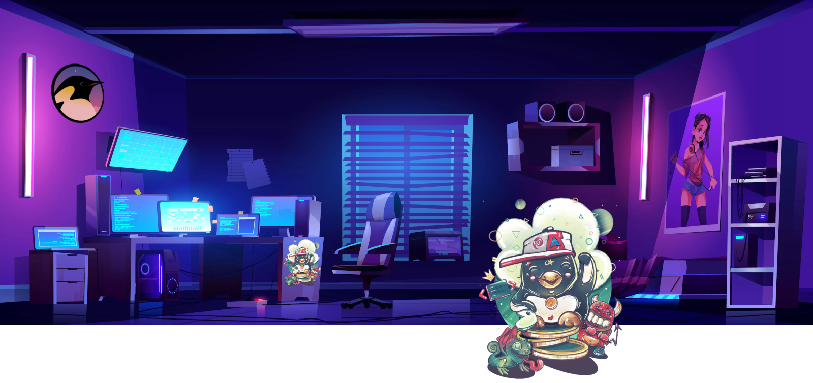

# geek-room

**Welcome to my room!**

Greetings to all open minds here!

This channel is focused on new technologies, software features, game news and GNU/Linux :penguin:

Individual topics will be gradually covered and YT videos will be uploaded and connected. So I'm presenting a preliminary plan here too. If you are interested in other points, create an GitHub issue, we will discuss it.

There are a list of following topics

<!--ts-->
* [geek-room](#geek-room)
   * [Technical](#technical)
   * [Distros](#distros)
   * [Games](#games)

<!-- Added by: box, at: Sun Nov  6 09:00:41 AM CET 2022 -->

<!--te-->

## Technical

* [Git Bare Repository for Dotfiles](git-bare-repo/git-bare-repo.md)
* Polybar for DWM, AW
* [Pass, gpg, passff, rofi-pass, password store, OpenKeyChain](pass-zx2c4/pass-zx2c4.md)
* With Ansible on daily routines
* Notable: Markdown Notes Taking

## Distros

* Gentoo Dailydriver
* MX-Linux Dailydriver
* Mabox Dailydriver

## Games
* Minecraft Linux Basic Installation
* Minecraft Advanced Addons Installation
* Minecraft Survive
