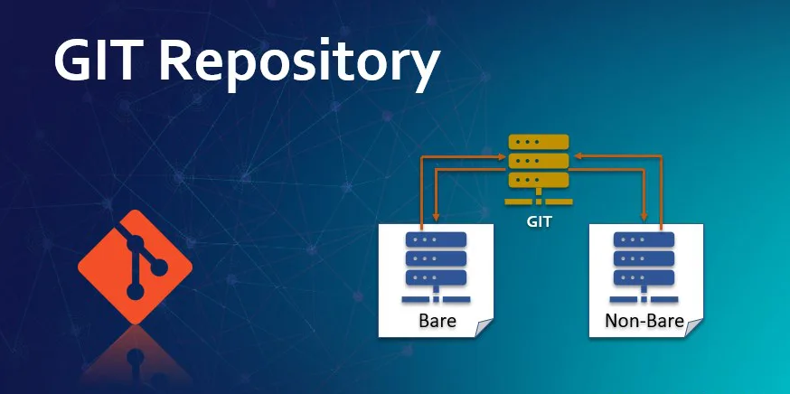

# git-bare-repo

<!--ts-->


<!-- Created by https://github.com/ekalinin/github-markdown-toc -->
<!-- Added by: box, at: Thu Feb 29 12:01:13 PM CET 2024 -->

<!--te-->

## What is a bare git repository?

For full description, please refer this [article from Jon Saints](https://www.saintsjd.com/2011/01/what-is-a-bare-git-repository/).

The git bare repo hasn't working tree. If you are clone it, you can directly content of meta data which is known from `.git` folder. 

Main goal of bare repo is on the server side to **share git repo** prepared for checkout with client users.

We can use this feature as a trick for a storage of our GNU/Linux dotfiles. Original idea is from [Hacker News User StreakyCobra](https://news.ycombinator.com/item?id=11070797). Some additional articles are continue, for example [Bitbucke Nicola Paolucci](https://www.atlassian.com/git/tutorials/dotfiles).

Technique is simple and very powerful. Let's go!

First we create bare repository in our home directory, switch off and stop tracking of untracked files. This second point is very important, because we want to git tracking just for manual added files from us, not all files from home dir! Last steps is for easy writing our commands - create alias for our bare git dotfiles repo.

```shell
git init --bare $HOME/.dotfiles # create bare git repo in home directory sub-folder .dotfiles
alias config='git --git-dir=$HOME/.dotfiles/ --work-tree=$HOME' # create alias in your shell config file
config config --local status.showUntrackedFiles no # stop tracking of home dir files, we need just manual added git files tracked
```

It's done! The repo is ready. Now, we can start use it.

```shell
config status
config add .xinitrc
config commit -m "Add xinitrc X11 starting file."
config add .bashrc
config commit -m "Add bashrc Bash configuration."
config push 
```

For `config push`, you need already created git remote repo, or you have to connect your bare repo with existing/created repo.

```shell
config remote set-url origin git@github.com:user/dotfiles.git # just for example, connect git local repo with your remote, or create new one
git push -u origin main # push to main branch or specific station branch. Branches are created for each station or station group
```

So, what did you done? If you look to your `alias`, whole home directory is used as BARE repository for you git. You can easily add any files which you want to have revision git control for this file! It is freedom, just add files, check their statuses, update it, delete it, create branches for other stations, sync files between stations, servers etc. 

**Much more powerful against standard git repo**. 

## Init your dotfiles for new station or station recovery

You have stored your dotfiles in git server. Now, you want to share it on new server. Or you have corrupted files in your station and need recovery. How to do it?

Create simple bash script for it and just call it. Store this script to your dotfiles `.local/bin` and ensure that this path will be in your senv `$PATH`.

```shell
#!/bin/bash
#script: init-env-dotfiles.sh
git clone --bare git@github.com:user/dotfiles.git $HOME/.dotfiles
function config {
   /usr/bin/git --git-dir=$HOME/.dotfiles/ --work-tree=$HOME $@
}

config checkout --force
config config status.showUntrackedFiles no
```

Important is `--force` argument to git which ensures that all git-driven files will be without compromise rewrite with your git stored files revisions.

**Simple and effective.**

## Next Game Level

Sometimes you want to share your specific configuration projects, like `neovim`, `awesomewm`, `xmonad`, `dwm`, `emacs` etc. You don't want to have all-in-one. You want to share your specific project in Github, but you want to use it in your dotfiles too. How to do it?

You have two choices which are provided by git
* git submodules
* git subtrees

Git submodules are most known. But it has pros and several cons too. For bare git repo and dotfiles is much more better to use second choice - `git subtrees`.

Just create initialization script where create git subtrees and checkout it to your dotfiles project. There is example of it.

```shell
#!/bin/bash
# script: init-git-subtrees-dotfiles.sh
function config {
   /usr/bin/git --git-dir=$HOME/.dotfiles/ --work-tree=$HOME $@
}

config subtree add --prefix .config/awesome git@github.com:raven2cz/awesomewm-config.git master --squash
config subtree add --prefix .config/polybar git@github.com:raven2cz/polybar-config.git main --squash
config subtree add --prefix .config/doom git@github.com:raven2cz/emacs.git main --squash
config subtree add --prefix .config/qtile git@github.com:raven2cz/qtile-config.git main --squash
config subtree add --prefix .config/i3 git@github.com:raven2cz/i3-config.git main --squash
config subtree add --prefix .config/xfce4 git@github.com:raven2cz/xfce-config.git main --squash
config subtree add --prefix .config/openbox git@github.com:raven2cz/openbox-config.git main --squash
config subtree add --prefix .config/nvim git@github.com:raven2cz/neovim.git main --squash
config subtree add --prefix .config/rofi git@github.com:raven2cz/rofi-themes.git main --squash
```

All these projects are linked to appropriate folders and can be used or patched with your bare dotfiles git repo.

If you already have added subtrees to your project, and make some change in your partial project, just call `pull script`. Similar as this one, just use instead of `subtree add` -> `subtree pull`. The project will be auto-merged/sync with your dotfile project. After merging just call `config push` to send new updated subtree to your remote git server.

Can you check which `git subtree` are already connected? Create git command in your `.gitconfig`.

```shell
[alias]
        ls-subtrees = !"for i in $(git log | grep git-subtree-dir | sed -e 's/^.*: //g' | sort | uniq); do test -d $i && echo $i; done"
```

Just call `lb-subtress` to print which subtrees are connected to your git repo.

**Now, you have all weapons for complete administration of your dotfiles.**

## Version Control for root files and system files

Some users ask me: "How to version control system files?" They have mainly server side changes or user patches of system files.

It can be control still by same principle. **System bare git repository** has to use whole file system root, or some specific system folder, like `/etc`, `/opt`, etc. 

I don't use it. I tried to use extension points of system folders, like `.d` dirs and other EP techniques. For system backup and restore, I'm using `restic` administration tool. 

I have just few files in file systems which needs version control. I'm using simple script to `copy` and `restore` these files to my `~/.root` folder which is part of home folder and dotfiles bare git repo. So, I have still just **one home dir git dotfile repository**.

## Conclusion

Sometimes I have problems that I added config files are automatically changed with some application itself. You can remove these files from version control or just call `config restore .` for these files or full whole home dir to restore these changes. 

My workflow is update/pull script which automatically update all my local repos and dotfiles bare git repo too.

```shell
#!/bin/bash
# script: pull-all-repos-update.sh
function config {
   /usr/bin/git --git-dir=$HOME/.dotfiles/ --work-tree=$HOME $@
}

config pull --autostash # git bare dotfiles repo
cd ~/org && git pull --autostash # emacs and notable repos
cd ~/.password-store && pass git pull --autostash # pass repo
cd ~/Pictures/wallpapers/public-wallpapers && git pull --autostash # shared wallpapers repo
```

You can see that there is used `--autostash` argument to stash local changes, mainly because I sometimes stored automatic changed config files too. This is next simple trick how to handle these _mixtures_.

Bare git repository is **the powerful tool** for the version control of your dotfiles.

