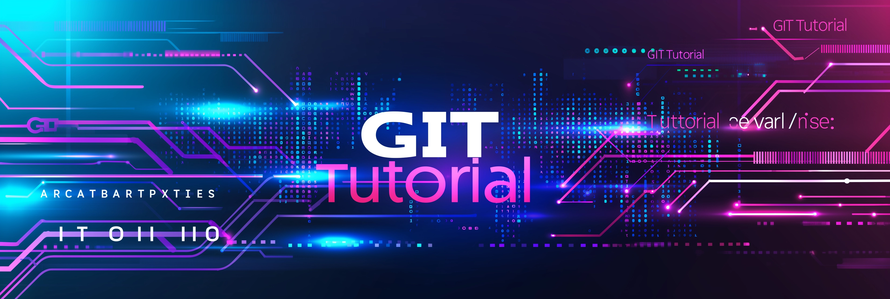
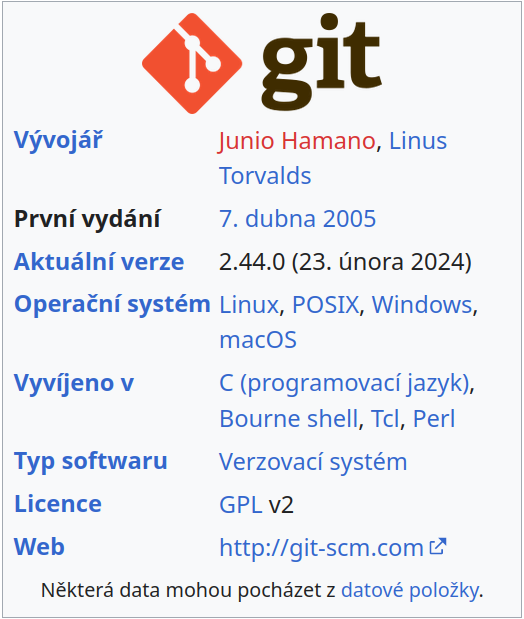
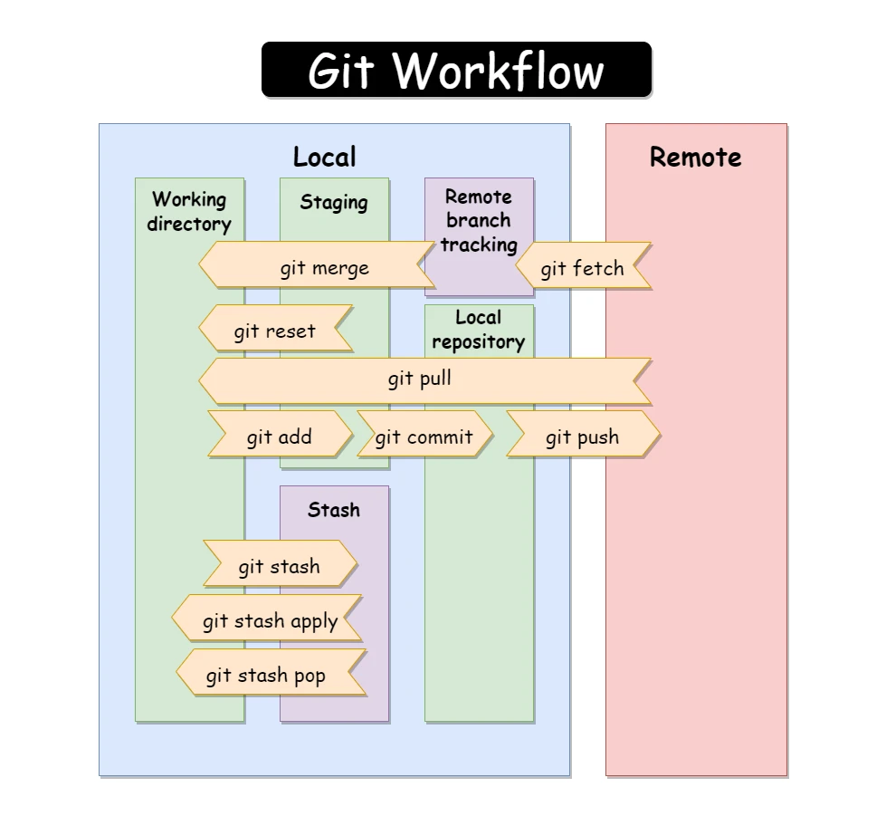
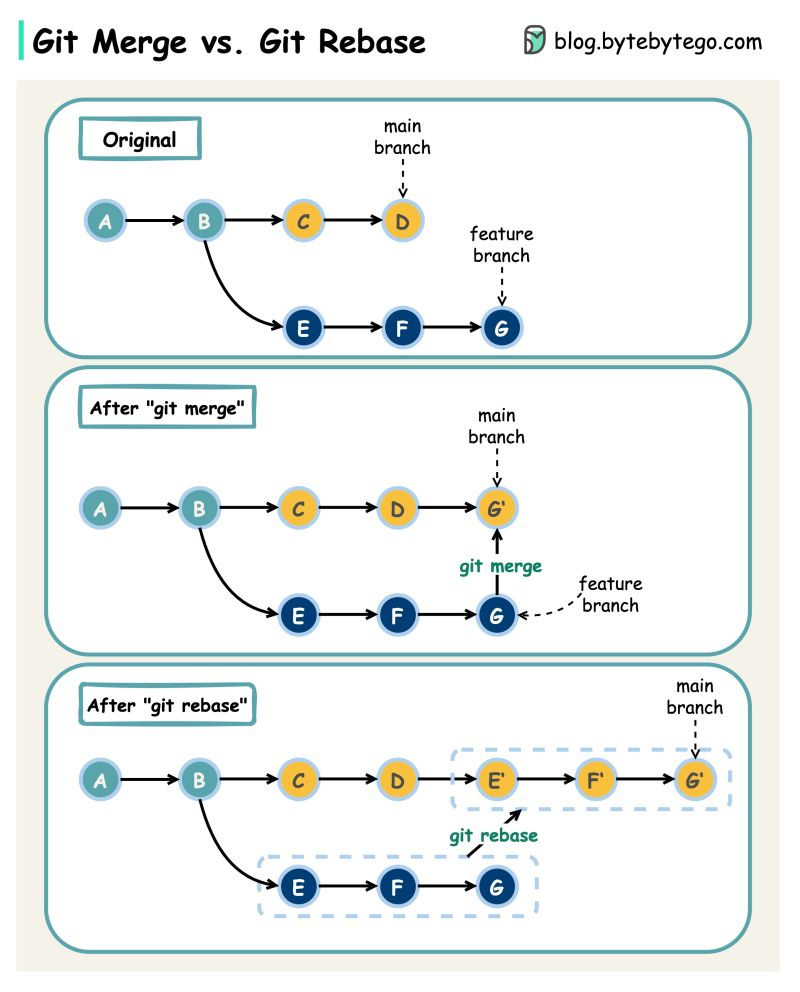
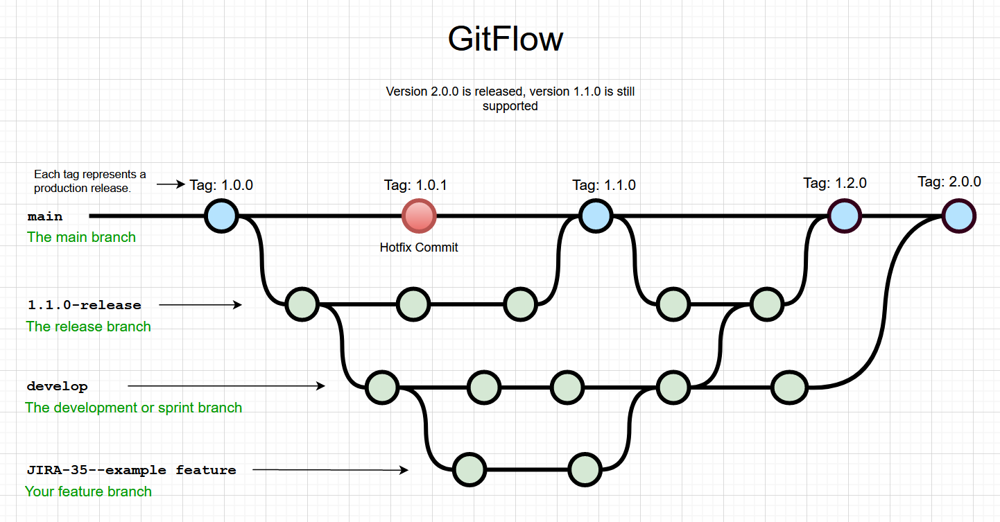

# git-tutorial-en

<!--ts-->


<!-- Created by https://github.com/ekalinin/github-markdown-toc -->
<!-- Added by: box, at: Thu Mar 14 08:16:07 AM CET 2024 -->

<!--te-->

# Part 1: Introduction to Git

## What is Git and Why Use It

- **Definition of Git**: Git is a distributed version control system that enables efficient management of code versions and collaboration among developers.
- **Advantages of Using Git**:
  - **Security**: Code changes are trackable and reversible.
  - **Flexibility**: Working with multiple versions of a project simultaneously.
  - **Collaboration**: Allows teams to collaborate efficiently on a single project.



## Git is a Complex Tool
- All roads lead to Rome.

- Recommended documentation:
  - https://git-scm.com/book/en/v2
  - https://github.com/progit/progit2
  - https://www.root.cz/books/pro-git/
  - https://rogerdudler.github.io/git-guide/

## Installation and Basic Configuration
Installing Git varies depending on the operating system. Here are the basic steps for installing Git on Windows, Linux, and macOS:

### Windows

1. **Download Git**: Go to the official Git website [https://git-scm.com/](https://git-scm.com/) and download the latest version for Windows. Optionally, consider the add-on: https://tortoisegit.org/
2. **Run the installer**: After downloading, run the installer file and follow the instructions of the installation wizard. During installation, you can choose various installation options, such as the editor you want to use with Git, and the paths where you want Git to be installed.
3. **Verify the installation**: After completing the installation, open Command Prompt (CMD) or PowerShell and enter `git --version` to verify that Git has been correctly installed.

### Linux

Installing Git on Linux is usually done through the package manager of the distribution.

#### Debian/Ubuntu

```shell
sudo apt-get update
sudo apt-get install git
```

#### Fedora

```shell
sudo dnf install git
```

#### Arch Linux

```shell
sudo pacman -S git
```

To verify the installation, enter `git --version`.

### macOS

1. **Use Homebrew**: The easiest way to install Git on macOS is to use Homebrew, which is a package manager for macOS. If you don't have Homebrew installed yet, you can install it by running the following command in Terminal:

   ```shell
   /bin/bash -c "$(curl -fsSL https://raw.githubusercontent.com/Homebrew/install/HEAD/install.sh)"
   ```

   Then install Git using Homebrew:

   ```shell
   brew install git
   ```

2. **Download and install manually**: You can also download the Git installer for macOS from the official website [https://git-scm.com/download/mac](https://git-scm.com/download/mac) and follow the instructions of the installer.

## Git Configuration
- Setting up user name and email:

```shell
git config --global user.name "Your Name"
git config --global user.email "your_email@example.com"
```

- **Example of a `~/.gitconfig` file**
```ini
[user]
  name = full name
  email = email@example.com
[pull]
  rebase = true
[push]
  default = current
[alias]
  ls-subtrees = !"for i in $(git log | grep git-subtree-dir | sed -e 's/^.*: //g' | sort | uniq); do test -d $i && echo $i; done"
  ci = commit
  st = status
  pus = push
  pul = pull
  a = add
  d = rm
  delete = rm
  del = rm
  co = checkout
  br = branch
  res = reset
  mer = merge
  reb = rebase
  rb = rebase
  pop = stash pop
  sh = stash
  srb = svn rebase
  rbm = rebase main
  rbw = rebase work
  cow = checkout work
  com = checkout main
  lg = log --graph
  fet = fetch
  f = fetch
  difff = diff
  di = diff
  rbom = rebase origin/main
  dsf = "!git diff --color $@ | diff-so-fancy"
[init]
  defaultBranch = main
[http]
  sslBackend = openssl
[credential]
  helper = cache
[merge]
  tool = meld
```

## Basic Concepts

- **Repository**: The place where all project files and their change history are stored. A repository can be local (stored on the computer you are working on) or remote (stored on a server, such as GitHub, GitLab, or Bitbucket).

- **Commit**: A record in the repository's history that contains changes along with a unique identifier (hash), the author of the change, and a message describing the change.

- **Branch**: An independent line of development in the repository, allowing developers to work on different features or fixes in parallel without affecting the main code line (main/master branch).

- **Stage Area (Index)**: A transitional area where developers add changes in files before committing. It allows selecting specific changes to be included in the next commit.

- **Main Branch**: The default branch of the repository where all stable changes are integrated. Historically known as `master`, but newer conventions recommend using `main`.

- **Git Server (Remote)**: A server hosting remote repositories and facilitating collaboration among developers. Git servers provide tools for access management, code review, branch management, and more.

- **Fork**: A copy of a remote repository that is stored under another user's account. Forks allow users to independently create changes from the original repository and then propose integrating these changes back into the original project through pull requests.

- **Merge**: The process of incorporating changes from one branch into another. It can be automatic if there are no conflicts, or it may require manual resolution of conflicts between files.

- **Rebase**: An alternative method of integrating changes from one branch into another, rewriting history to appear as if the branch began from the last commit of the branch it is being merged into. It allows for a cleaner linear history.

- **Pull Request (PR) / Merge Request (MR)**: A feature on code hosting platforms like GitHub or GitLab that allows developers to propose changes and request their integration into the project's main branch. PR/MR are key for code review and discussion about changes.

## Git Workflow



## Summary

- In this section, we introduced Git, its advantages, performed basic installation and configuration, and familiarized ourselves with key concepts such as repository, commit, and branch.

We will continue with the second part of the tutorial, focusing on "Working with Repositories". This part will cover basic Git operations like creating, cloning repositories, and basic branch work.

# Part 2: Working with Repositories

## Creating and Cloning Repositories

- **Creating a New Repository**:
  - Example of creating a repository directly on GitHub or GitLab.
  - Initializing a new repository in an existing directory:

  ```shell
  git init
  ```

- **Cloning a Repository**:
  - Cloning an existing repository from GitHub or another remote server:

  ```shell
  git clone https://github.com/user/repository.git
  git clone git@github.com:raven2cz/dotfiles.git .dotfiles
  ```

## Basic Operations: add, commit, push, pull

- **Adding Files** (`git add`):
  - Adding a single file to the stage area:

    ```shell
    git add file.txt
    ```
  - Adding all changed files to the stage area:

    ```shell
    git add .
    ```
- **Creating a Commit** (`git commit`):
  - Creating a commit with a descriptive message:

    ```shell
    git status # to view planned changes in the stage area
    git diff # to browse through your changes

    git commit -m "Description of changes"

    git diff --staged # to browse changes in staged
    git log --oneline # git log per one line
    git reset --soft HEAD~1 # to cancel the last commit and return changes to the pre-commit state

- **Pushing Changes** (`git push`):
  - Sending local changes to a remote server (e.g., GitHub):

    ```shell
    git push origin main
    git push
    ```

- **Updating the Local Repository** (`git pull`):
  - Downloading changes from a remote repository:

    ```shell
    git pull origin main
    git pull
    ```

## Working with Branches (branching) and Basics of Merging

**Git Workflow Branch**


- **Creating a New Branch and Working in the Branch**:
  - How to create and switch to a new branch:

    ```shell
    git branch new-branch # new branch, lists local branches without a name
    git checkout new-branch # switching branches

    git checkout -b new-branch # one-liner variant
    # make implementation changes...
    git add --all # all changes to staged area
    git add -u # add changes only for files already part of the git repo
    git commit -m "feature/name description of feature"
    git push -u origin new-branch # first push to a branch that does not exist in origin yet
    ```

- **Merging**:
  - Merging changes from one branch to another. This is usually part of MR/PR for the main branch, which we will talk about later.

    ```shell
    git checkout main
    git pull
    git merge new-branch
    git rebase new-branch # rebase version of merging (more commonly used)
    git branch -d new-branch # be careful, this only removes the branch locally
    ```

## Adding an Existing Project and Pushing It to a New Git Repo

Let's try a "slightly" more complicated example for pushing the state of a project that already existed on your disk but was not part of git, and you still want it to be tracked by git.

```shell
cd existing-project

git init
git add --all
git commit -m "Initial Commit"
git remote add origin https://user@bitbucket.cz/scm/git/git-tutorial.git
git push -u origin main
```

## Summary

- In this part, we learned how to create and clone repositories, perform basic operations like add, commit, push, and pull, and also how to work with branches and perform basic merging.

Next, we will look at the third part of the tutorial, which will focus on "Advanced Git Operations". This part will contain information on conflict resolution, rebasing, and tagging, which are important for efficient version management and collaboration on projects. The structure in Markdown will serve as a script for your video.

# Part 3: Advanced Git Operations

## Conflict Resolution During Rebase

- **Identifying and Resolving Conflicts**:
  - How Git announces conflicts during rebase (merge).
  - Using IDE editor or visual comparison tools for manual conflict resolution, e.g., `meld`.
  - Finalizing conflict resolution commit:

    ```shell
    git mergetool # (resolve all conflicts until everything is green, possible to run tests, checks, delete backups)
    git add --all # (if further fixes are made post-merge, backups should be deleted)
    git status
    git rebase --continue # (completes rebase, MAKES COMMITS, importantly do not do git pull now!)
    git push -f # (force push necessary due to changes in commit order!)
    ```

## Rebase vs. Merge

Both operations, `rebase` and `merge`, are ways to integrate changes from one Git branch into another. While serving a similar purpose, they have different effects on repository history and workflow.

### Differences Between Rebase and Merge



- **Merge**:
  - **Merge operation** takes changes from one branch (`feature branch`) and integrates them into another branch (`main` or `develop`), creating a new *merge commit*. This commit has two parents, which are the last commits of both merged branches.
  - **When to use**: Merge is suitable when you want to preserve the complete history and context of development. It's the standard way to incorporate completed features or fixes into the main branch, clearly marking it as a separate development path.

- **Rebase**:
  - **Rebase operation** moves or "replays" commit(s) from one branch onto the "tip" of another branch, creating a linear history. This means the commits from the feature branch will appear as if they were made directly at the current end of the main branch, to which rebase is applied.
  - **When to use**: Rebase is ideal when you want to maintain a clean, linear history of commits, or when you need to update your branch with the latest changes from the main branch before merging. It helps avoid merge commits and keeps the

history clean.

### Using Rebase

Rebase is useful for cleaning up the commit history and eliminating unnecessary merge commits. For instance, if you're working on a feature branch and want to update it with the latest changes from the `main` (or `develop`) branch, you can use:

```shell
git checkout feature-branch
git rebase main
```

This will place the changes from `main` underneath your changes from `feature-branch`, creating a clean, linear history. After completing the rebase, you might need to *force-push* the changes to the remote repository (if you've already pushed changes before the rebase), use with caution:

```shell
git push origin feature-branch --force
```

**Why use rebase**: Rebase helps keep the project's history cleaner and more organized. It helps avoid the complications that can arise from merges and facilitates code review by providing a linear trail of changes.

It's always important to consider the context and team workflow when deciding whether to use rebase or merge to make collaboration as efficient and pleasant as possible for everyone involved.

## Handling Feature Branches - Branch for a Single Developer!

```shell
git checkout main
git pull
git checkout raven2cz/SRCH-7693_Drop_Redirect_Content
git pull # (if the feature branch is not updated!)
git rebase main # (save or slightly modify commit notes)
## if conflicts --------
git mergetool # (resolve all conflicts until everything is green, possible to run tests, checks, delete backups)
git add --all # (if further fixes are made post-merge, but backups should already be deleted)
git rebase --continue # (completes rebase, MAKES COMMITS, importantly now do not do git pull!)
##----------------------
git push -f # (force push necessary due to changes in commit order)
git status # (should now say everything

is up-to-date, verify in merge request that everything is okay)
```

## How to Synchronize Branches That Were Deleted Remotely but Remain Locally?

```shell
git fetch --tags --prune --prune-tags
```

## Tagging and Its Use for Versioning

**Creating Tags**:

Using tags to mark significant points in the project's history, e.g., project releases:

```shell
git tag -a v1.0.0 -m "Project v1.0.0 released."
git push origin --tags
```

### Reverting Changes in the Current Repository

```shell
git checkout -- . # older command, more practical
git restore .  # newer command designed to restore chosen files
```

### Git Cherry-pick

Changes have already been applied in branchA, but this branchA is based on an old main, where changes from a previous MR have not been merged. We need to synchronize with the newly merged main but take the new changes from branchA.

So, I will create a new branchB synchronized with the current main, where the changes from branchA are merged, and select the changes from branchA. Verify the results and after that delete branchA.

```shell
git checkout raven2cz/branchA
git log # copy commit SHAs which you need in branchB
git checkout main
git pull
git checkout -b raven2cz/branchB
git cherry-pick -n <list of SHAs> # --no-commit, you have to make commit with message
git status
git commit -m "New Message for your cherry-pick commits."
git log
git branch -D raven2cz/branchA
```

## Git Clean Main

```shell
# 1st variant
git reset --hard # removes staged and working directory changes
# 2nd cleaner variant
# Note that git clean -f -d also deletes files from ignored directories. So, all local logs and similar

things will be gone. Usually, this isn't a big deal, but it's good to be aware.

```shell
git clean -f -d # remove untracked
git clean -f -x -d # CAUTION: as above but removes ignored files like config.
git clean -fxd :/ # CAUTION: as above, cleans untracked and ignored files throughout the entire repo (without :/, the operation affects only the current directory)
```

## Summary

- In this part, we focused on advanced Git operations, including resolving conflicts during merging, understanding and using rebase to maintain a cleaner history of commits, and creating tags for better version management. These skills are crucial for efficient version management and collaboration on larger projects.

Next, we will move on to the fourth part of the tutorial, which will be dedicated to "Working with Remote Repositories". This part will focus on basic and advanced operations with remote repositories, including working with remotes, forking, and pull requests. The Markdown structure will serve as a script for your video.

# Part 4: Working with Remote Repositories

## Basics of Remote Repositories

### Adding a Remote Repository

- How to add a remote repository:
  ```shell
  git remote add origin https://github.com/user/repository.git
  ```
  
### Listing Remote Repositories

- Command to list remote repositories:
  ```shell
  git remote -v
  ```

### Changing Remote Repository for Your Project

```shell
git remote -v # displays current mapping to remote server
git remote set-url origin git@server.org:user/repo.git # connects new mapping
git remote -v origin # verification
```

## Forking and Pull Requests

### Forking a Project

Forking is the process of creating your own copy of someone else's repository in your GitHub (Gitlab, Bitbucket, Gitea,...) account so you can propose changes without affecting the original project. This is fundamental for open-source collaboration.

1. **How to perform a fork**:
   - Go to the repository page on GitHub (Gitlab, Bitbucket, Gitea,...).
   - Click on the "Fork" button at the top of the page.
   - This creates your own copy of the repository in your account.

### Creating Pull Requests

A Pull Request (PR) is how you notify others about the changes you've pushed to your fork. PR asks the owner of the original repository to "pull" your changes into their repository.

1. **How to create a PR**:
   - After completing your changes in the fork, go to the original repository's page on GitHub (Gitlab, Bitbucket, Gitea,...).
   - Click on "New Pull Request".
   - Select the branches you want to compare changes between, then click "Create Pull Request".
   - Add a description of your changes and what issue they address, then submit the PR.

### Working with Github Schema

-

### Advanced Work with Github/Gitlab Fork

#### How It's Done?

Assuming we've already made a _fork_. For this example, I'll use the original repository [gruntwork-io/terratest](https://github.com/gruntwork-io/terratest), which I have forked as [sw-samuraj/terratest](https://github.com/sw-samuraj/terratest).

_(You can run all the following commands locally without worry. Only if you wanted to try_ push_, of course, you'd need to make your own_ fork_.)_

Now, let's make a _clone_ of the forked repo:

```shell
git clone git@github.com:sw-samuraj/terratest.git
```

and list the default set of _remote_ repositories:

```shell
$ git remote -v
origin  git@github.com:sw-samuraj/terratest.git (fetch)
origin  git@github.com:sw-samuraj/terratest.git (push)
```

#### Adding the Original Repository

The original repository – often called upstream – is added with the command:

```shell
$ git remote add upstream git@github.com:gruntwork-io/terratest.git
```

We list the _remote_ repositories again and see we have two:

* origin is our new _fork_.
* upstream is the original repository.

```shell
$ git remote -v
origin  git@github.com:sw-samuraj/terratest.git (fetch)
origin  git@github.com:sw-samuraj/terratest.git (push)
upstream  git@github.com:gruntwork-io/terratest.git (fetch)
upstream  git@github.com:gruntwork-io/terratest.git (push)
```

#### Pulling Changes from the Original Repository

The actual synchronization consists of four steps:

1. Fetch changes in the original repository (upstream).


2. Checkout the local branch where you want to propagate changes.
3. Merge the specific upstream branch.
4. Push to the forked (origin) repository.

```shell
$ git fetch upstream
$ git checkout master
$ git merge upstream/master
$ git push
```

Whether you make your changes before or after the merge from the upstream repository is up to you. A good rule is to perform synchronization before starting work on a new _pull request_.

#### RESET fork to origin (for example awesomeWM)

```shell
git remote add upstream git@github.com:awesomeWM/awesome.git

git fetch upstream
git checkout master
git reset --hard upstream/master  
git push origin master --force 
```

And that's all. _Happy contributing!_

We will now look into a detailed explanation of the GitFlow workflow, which is a popular branch management model in Git. GitFlow provides a structured way to organize branches and manage development, releases, and bug fixes. This approach helps teams keep development organized and simplifies the software release process.

# GitFlow Workflow

GitFlow is a workflow designed by Vincent Driessen that defines a rigid structure for branches and their use in the development process. This model is particularly suitable for projects that have regularly scheduled version releases.

### Basic Principles of GitFlow

GitFlow divides branches into two main categories: main branches and supporting branches. The main branches are `master` and `develop`, while supporting branches include `feature`, `release`, and `hotfix` branches.

1. **Main Branches**:
   - `main`: This branch contains production code. Everything in `main/master` should be ready for immediate deployment.
   - `develop`: This branch is for development, where features for the next release are integrated. This branch serves as the basis for new `feature` branches.

2. **Supporting Branches**:
   - `feature`: Branches created from `develop` for working on new features or improvements. Once completed, they are merged back into `develop`.
   - `release`: A branch derived from `develop` designed to prepare a new version release. It allows for last-minute adjustments and bug fixes before merging into `main` and also back into `develop`.
   - `hotfix`: Branches created directly from `main` for fixing bugs in the production environment. Upon completion, they are merged both into `main` and `develop`.

### Using GitFlow

Using GitFlow begins with initialization in your repository, setting up the necessary branches. During development, the team creates new `feature` branches for each function or adjustment. Once the feature is complete, it merges back into `develop`.

When preparing to release a new version, a `release` branch is created, which serves for final adjustments. Upon completion, the `release` branch is merged into `main` (also marking the new version with a tag) and back into `develop` to retain all changes.

`Hotfix` branches allow for quick fixes without affecting regular development and are merged in the same way as `release` branches.

### Working with GitFlow in Images

-
-

### Summary

GitFlow provides a clear framework for version and branch management, supporting continuous development, easy release of new versions, and quick bug fixes. Its structure and rules facilitate team collaboration and help maintain organization and clarity in projects.

We will continue with the fifth part of the tutorial, which is dedicated to "Effective Use of Git." This part will cover advanced techniques and tools that developers can use to streamline work with Git repositories, including stashing, reflog, and working with the `.gitignore` file. A detailed description of these concepts will help users better understand Git's capabilities for managing changes and modifying project history.

# Part 5: Efficient Use of Git

Git offers a plethora of advanced tools and techniques that enable more efficient work and help keep your repositories clean and organized. This part explores several key features that every developer should know.

## Stashing Changes

Stashing is handy when you need to quickly switch contexts between branches but don't want to commit unfinished work on your current branch.

### How to Use Stash

1. **Storing changes in stash**:
   - To save your changes in a temporary storage, use:
     ```shell
     git stash # saves current changes in stash and reverts working directory to last commit
     git pull --autostash # for fetching new repo changes when having uncommitted work
     ```

2. **Applying changes from stash**:
   - To apply saved changes from stash onto the current branch, use:
     ```shell
     git stash pop
     ```
   - This command reapplies the changes and removes them from the stash.

## Working with Reflog

Reflog tracks changes in local repository references, enabling you to recover deleted branches or revert to previous states.

### How to Use Reflog

1. **Viewing reflog**:
   - To display the reference history, use:
     ```shell
     git reflog
     ```
   - Here you can find the commit ID you wish to revert to.

2. **Restoring using reflog**:
   - To revert to a certain commit from the reflog, use:
     ```shell
     git reset --hard HEAD@{index}
     ```
   - Replace `{index}` with the commit number from the reflog.

## Working with .gitignore

The `.gitignore` file allows Git to ignore specific files or directories that would otherwise be added to the repository.

### How to Set Up `.gitignore`

1. **Creating a `.gitignore` file**:
   - Create a `.gitignore` file in the root directory of your repository.
   - Add patterns for files or directories that Git should ignore.

2. **Examples of `.gitignore` Entries**:
   - To ignore all `.txt` files: `*.txt`
   - To ignore a specific directory: `logs/`
   - To ignore files but not a directory: `*.log !important.log`

#### Sample Advanced `.gitignore`

```
.idea/
*.iml
*.ipr
*.iws
target/
assembly/
**/.vscode/
.classpath
.project
.settings
.externalToolBuilders
*.log
dependency-reduced-pom.xml
.gradle
build
.gradle-build-cache/

# flow graphs
*.dot

# files from IDE
out

# temporary development data
_tmp/*

# ignore generated python protofiles
proto/public-api/python/dolores/
# ignore distribution packages
proto/public-api/python/dist

#osx
**/.DS_Store

# local interpretation outputs
interp/interpreter/outputs/*

# Python
**/venv/*
**/*ipynb_checkpoints/*
**/*virtual_documents/*
**/__pycache__/*
``` 

## Summary

In this section, we explored several advanced tools and techniques for efficient Git usage, including stashing for temporarily saving changes, tracking and restoring changes using reflog, and setting up `.gitignore` to ignore unnecessary files. These skills will help you keep your repositories clean and manage your work efficiently.

Next, we move on to Part 6 of the tutorial, focusing on "Security and Access Management in Git". This section will discuss key security aspects, such as SSH keys for secure repository connections, setting up and using Git Hooks for task automation, and securing repositories. This section will help users secure their code and enhance workflows through automation.

# Part 6: Security and Access Management

Security and proper access management are crucial for keeping your software projects safe. Git and related platforms like GitHub, Bitbucket, or GitLab offer several tools and practices to enhance the security of your repositories.

## SSH Keys

SSH keys enable secure communication between your computer and the Git server. Using SSH keys is safer than standard passwords because keys provide encrypted login without the need to enter a password.

### Setting Up SSH Keys

1. **Generating an SSH Key**:
   - Open the terminal and enter the following command to generate a new SSH key, replace `email@example.com` with your email:
     ```shell
     ssh-keygen -t rsa -b 4096 -C "email@example.com"
     ```
   - During the process, you can set a passphrase for additional security.

2. **Adding the SSH Key to ssh-agent**:
   - Start the ssh-agent in the background:
     ```shell
     eval "$(ssh-agent -s)"
     ```
   - Add your SSH key to the ssh-agent:
     ```shell
     ssh-add ~/.ssh/id_rsa
     ```

3. **Adding the SSH Key to GitHub/GitLab/Bitbucket**:
   - Copy the contents of the `~/.ssh/id_rsa.pub` file to your clipboard.
   - On the GitHub/Bitbucket/GitLab platform, go to the SSH key settings and paste the key.

## Git Hooks

Git Hooks are scripts that Git executes before or after events such as commit, push, or receive. You can use these scripts to automate tasks like linting, testing, or other control scripts.

### Git Hook Example

1. **Pre-commit Hook for Code Check**:
   - In `.git/hooks`, find the `pre-commit.sample` file and rename it to `pre-commit`.
   - Open the file and add a script for code check or running tests.
   - Now, this hook will be executed before every commit,

 ensuring that all changes meet your requirements.

## Repository Security

- **Access Restriction**: Ensure that only authorized users have access to your repository. Use features like private repositories, roles, and permissions on platforms like GitHub/Bitbucket/GitLab.
- **Code Review**: Utilize pull requests for peer code reviews, which help detect potential security issues or bugs before merging changes into the main branch.

## Summary

Security and access management are essential for protecting your projects. By using SSH keys, Git Hooks, and the correct setting of access controls, you can enhance the security and efficiency of your development process.

We move on to the seventh part of our tutorial, which focuses on "Git Tools and Extensions". This section will provide an overview of various tools and extensions you can use to extend Git functionalities, simplify certain tasks, and improve your productivity. From graphical user interfaces (GUIs) to integrations with Integrated Development Environments (IDEs) and Continuous Integration/Continuous Deployment (CI/CD) systems, there are many tools that can streamline your work with Git.

# Part 7: Git Tools and Extensions

Git is a powerful tool by itself, but its functionality and user-friendliness can be further extended with various tools and extensions. These tools can help simplify working with Git, provide a visual representation of data, and integrate with other systems and tools.

## Git GUI Clients

For users who prefer a graphical interface over the command line, there are several GUI clients that facilitate working with Git.

### Examples of Git GUI Clients

- **Sourcetree**: A user-friendly client from Atlassian that provides a graphical interface for repository management. It offers advanced features such as branch graphs, stashing, and cherry-picking.
- **GitKraken**: A cross-platform Git client with an intuitive interface that includes support for GitHub, GitLab, Bitbucket, and Azure DevOps.
- **GitHub Desktop**: A simple and clear client for GitHub users that facilitates basic operations such as commit, push, pull, and merge.
- **MeGit**: https://github.com/eclipsesource/megit newly separated from eclipse as a standalone application.

## IDE Integrations

Many integrated development environments (IDE) offer built-in support for Git, allowing developers to work with versioning directly from the IDE.

### Examples of Git Integrations with IDEs

- **Visual Studio Code (VSCode)**: Offers rich support for Git with the ability to perform commit, merge, rebase, and other operations directly from the editor.
- **IntelliJ IDEA**: Advanced Git support with features for branch visualization, conflict resolution, and GitHub integration.

## Git and CI/CD

Integrating Git with Continuous Integration (CI) and Continuous Deployment (CD) systems allows for the automation of testing, building, and deploying applications.

### Examples of CI/CD Tools Compatible with Git

- **Jenkins**: An open-source automation server that enables the automation of building, testing, and deploying applications.
- **GitHub Actions**: Allows creating CI/CD workflows directly in a GitHub repository, automating tests, builds, and application deployments.
- **GitLab CI/CD**: Offers a complete CI/CD solution integrated directly into GitLab, simplifying the pipeline for building, testing, and deploying.

## Summary

There are many tools and extensions that can enhance your Git experience and streamline your workflow. From graphical clients, through IDE integration, to CI/CD process automation, you can find solutions that best suit your needs and work style. These tools can help you better manage your projects, visualize development, and automate testing and deployment, leading to higher productivity and better team collaboration.

# Part 8: Practical Examples and Best Practices

This chapter focuses on practical Git usage scenarios, best practices for code management and collaboration, and how to write effective commit messages. This information will help you better utilize Git in your daily work and streamline your workflow.

### Practical Git Usage Scenarios

1. **Working on a New Feature**: Use *feature branches* for working on new features. This allows you to isolate the development of a new feature from the main development line (`main` or `develop`), facilitating code review and integration.
   
   ```shell
   git checkout -b feature/new-feature
   git checkout -b user/feature
   ```

2. **Bug Fixes**: Use *hotfix branches* for bug fixes, which allow you to quickly fix errors in production code and easily deploy them.
   
   ```shell
   git checkout -b hotfix/bug-fix
   git checkout -b user/hotfix
   ```

3. **Collaborating on a Project**: For effective collaboration, use the *forking workflow* or *feature branch workflow* with pull requests, allowing discussion on changes and code review before merging.

### Best Practices for Code Management and Collaboration

- **Maintain a Clean History**: Use rebase to maintain a linear history for easier navigation.
- **Minimal Functional Changes**: Each commit should contain the minimal amount of changes needed for one functionality or fix.
- **Frequent Commits**: Commit often, but with consideration for the completeness and significance of the changes.
- **Code Review**: Utilize pull requests for **code review**, which increases code quality and supports knowledge sharing within the team.

### How to Write Effective Commit Messages

- **Concise and Descriptive Title**: The first line of the commit message should clearly and concisely describe what the commit does.
- **Changes Description**: If necessary, provide a detailed description of the changes in the body of the message. Explain why the changes were made and how they address the issue.
- **Follow Conventions**: If your team or project has conventions for writing commit messages, adhere to them.

### Summary

Effective use of Git and adherence to best practices can significantly improve the management of your software projects and facilitate team collaboration. The key is regular practice, learning from feedback, and

adapting based on your own experiences and the needs of the project.

# Final Thoughts

Now that we have covered the key aspects of Git from basics to advanced techniques and tools, it's important to remember that practice is the best way to learn and improve in version management with Git. Experimenting with different approaches and using Git in real projects will help you better understand its capabilities and find the most efficient ways to use it in your development process.

- **Practice**: The best way to become a Git expert is through regular practice and experimenting with its various features and workflows.
- **Learning from Mistakes**: Don't be afraid to make mistakes. Git offers robust tools for recovery and correction, allowing you to learn from mistakes without serious impacts on your projects.
- **Community and Resources**: Take advantage of the rich resources available online, including documentation, tutorials, and forums. Git has a large and active community where you can find answers to your questions and share your experiences.

Thank you for following this tutorial. I hope it has provided you with a solid foundation and encouraged you to explore further and utilize Git in your projects. If you have any questions or need further assistance, don't hesitate to reach out to the community or seek additional resources. Git is a powerful tool that, when properly used, can significantly improve the quality and efficiency of your software development.

