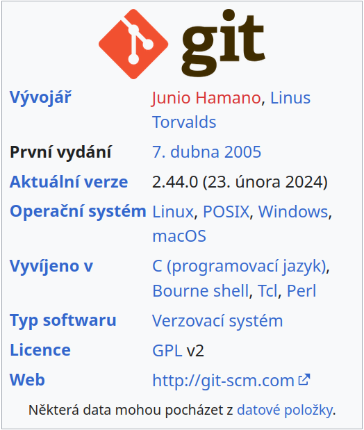
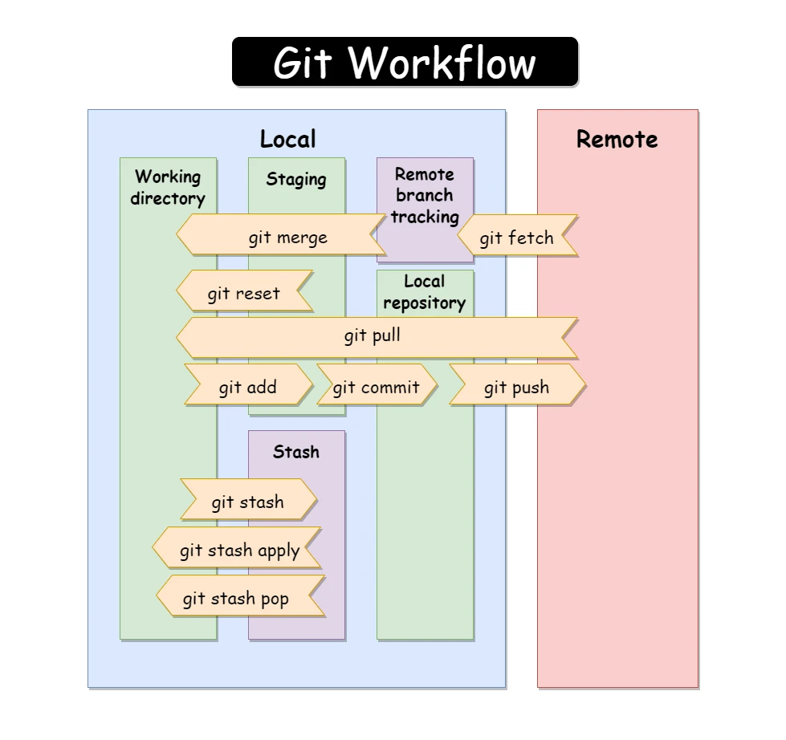
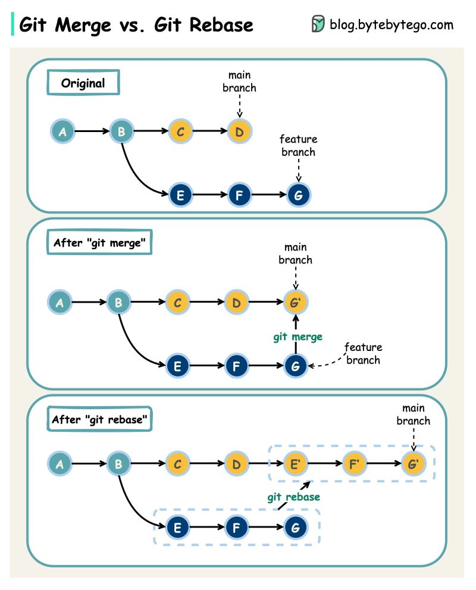

# git-tutorial

```table-of-contents
```

# Část 1: Úvod do Gitu

## Co je Git a proč ho používat

- **Definice Gitu**: Git je distribuovaný systém pro správu verzí, který umožňuje efektivní práci s verzemi kódu a spolupráci mezi vývojáři.
- **Výhody používání Gitu**:
  - **Bezpečnost**: Změny kódu jsou sledovatelné a reverzibilní.
  - **Flexibilita**: Práce s více verzemi projektu současně.
  - **Spolupráce**: Umožňuje týmům efektivně spolupracovat na jednom projektu.



## Git je komplexní nástroj
- Všechny cesty vedou do Říma. 

- Vhodná dokumentace:
  - https://git-scm.com/book/en/v2
  - https://github.com/progit/progit2
  - https://www.root.cz/knihy/pro-git/
  - https://rogerdudler.github.io/git-guide/

## Instalace a základní konfigurace
Instalace Gitu se liší podle operačního systému. Zde jsou základní kroky pro instalaci Gitu na Windows, Linux a macOS:

### Windows

1. **Stáhnout Git**: Přejděte na oficiální stránku Git [https://git-scm.com/](https://git-scm.com/) a stáhněte nejnovější verzi pro Windows. Také volitelně nadstavbu: https://tortoisegit.org/
2. **Spustit instalační program**: Po stažení spusťte instalační soubor a postupujte podle pokynů instalačního průvodce. Během instalace si můžete vybrat různé možnosti instalace, jako je editor, který chcete používat s Gitem, a cesty, kam chcete Git nainstalovat.
3. **Ověřit instalaci**: Po dokončení instalace otevřete příkazovou řádku (CMD) nebo PowerShell a zadejte `git --version` pro ověření, že Git byl správně nainstalován.

### Linux

Instalace Gitu na Linuxu se obvykle provádí prostřednictvím správce balíčků příslušné distribuce.

#### Debian/Ubuntu

```shell
sudo apt-get update
sudo apt-get install git
```

#### Fedora

```shell
sudo dnf install git
```

#### Arch Linux

```shell
sudo pacman -S git
```

Pro ověření instalace zadejte `git --version`.

### macOS

1. **Použití Homebrew**: Nejjednodušší způsob, jak nainstalovat Git na macOS, je použít Homebrew, což je správce balíčků pro macOS. Pokud ještě nemáte nainstalovaný Homebrew, můžete jej nainstalovat spuštěním následujícího příkazu v Terminálu:

   ```shell
   /bin/bash -c "$(curl -fsSL https://raw.githubusercontent.com/Homebrew/install/HEAD/install.sh)"
   ```

   Poté nainstalujte Git pomocí Homebrew:

   ```shell
   brew install git
   ```

2. **Stáhnout a nainstalovat ručně**: Můžete také stáhnout instalační program Git pro macOS z oficiálních stránek [https://git-scm.com/download/mac](https://git-scm.com/download/mac) a postupovat podle pokynů instalačního programu.

## Konfigurace Gitu
  - Nastavení uživatelského jména a e-mailu:

  ```shell
   git config --global user.name "Vaše Jméno"
   git config --global user.email "vas_email@example.com"
   ```

- **Ukázka konfiguračního souboru `~/.gitconfig`**
```ini
[user]
  name = full name
  email = email@example.com
[pull]
  rebase = true
[push]
  default = current
[alias]
  ls-subtrees = !"for i in $(git log | grep git-subtree-dir | sed -e 's/^.*: //g' | sort | uniq); do test -d $i && echo $i; done"
  ci = commit
  st = status
  pus = push
  pul = pull
  a = add
  d = rm
  delete = rm
  del = rm
  co = checkout
  br = branch
  res = reset
  mer = merge
  reb = rebase
  rb = rebase
  pop = stash pop
  sh = stash
  srb = svn rebase
  rbm = rebase main
  rbw = rebase work
  cow = checkout work
  com = checkout main
  lg = log --graph
  fet = fetch
  f = fetch
  difff = diff
  di = diff
  rbom = rebase origin/main
  dsf = "!git diff --color $@ | diff-so-fancy"
[init]
  defaultBranch = main
[http]
  sslBackend = openssl
[credential]
  helper = cache
[merge]
  tool = meld
```

## Základní pojmy

- **Repozitář (Repository)**: Místo, kde jsou uloženy všechny soubory projektu a jejich historie změn. Repozitář může být lokální (uložený na počítači, kde pracujete) nebo vzdálený (uložený na serveru, například na GitHubu, GitLabu, nebo Bitbucketu).

- **Commit**: Záznam v historii repozitáře, který obsahuje informace o změnách spolu s unikátním identifikátorem (hash), autorem změny, a zprávou popisující změnu.

- **Branch (Větev)**: Nezávislá linie vývoje v repozitáři, která umožňuje vývojářům pracovat na různých funkcích nebo opravách paralelně bez ovlivnění hlavní linie kódu (main/master branch).

- **Stage Area (Index)**: Přechodová oblast, kam vývojáři přidávají změny v souborech před commitováním. Umožňuje výběr specifických změn, které mají být součástí následujícího commitu.

- **Main Branch (Hlavní větev)**: Výchozí větev repozitáře, kam jsou integrovány všechny stabilní změny. Historicky byla známá jako `master`, ale novější konvence doporučuje používat `main`.

- **Git Server (Remote)**: Server, který hostuje vzdálené repozitáře a umožňuje spolupráci mezi vývojáři. Git servery poskytují nástroje pro správu přístupu, revizi kódu, správu větví a další.

- **Fork**: Kopie vzdáleného repozitáře, která je uložená pod účtem jiného uživatele. Fork umožňuje uživatelům vytvářet změny nezávisle na původním repozitáři a poté navrhnout začlenění těchto změn zpět do původního projektu prostřednictvím pull requestů.

- **Merge**: Proces začlenění změn z jedné větve do jiné. Může být automatický, pokud neexistují žádné konflikty, nebo může vyžadovat ruční řešení konfliktů mezi soubory.

- **Rebase**: Alternativní metoda integrace změn z jedné větve do jiné, která přepisuje historii tak, aby vypadalo, že větev začala z posledního commitu větve, do které se začleňuje. Umožňuje čistější lineární historii.

- **Pull Request (PR) / Merge Request (MR)**: Funkce na platformách pro hostování kódu, jako je GitHub nebo GitLab, která umožňuje vývojářům navrhnout změny a požádat o jejich začlenění do hlavní větve projektu. PR/MR jsou klíčové pro revizi kódu a diskusi o změnách.

## Git Workflow



## Shrnutí

- V této části jsme si představili Git, jeho výhody, provedli základní instalaci a konfiguraci, a seznámili se s klíčovými pojmy jako repozitář, commit a branch.

Pokračujeme s druhou částí tutoriálu, která se zaměřuje na "Práci s repozitáři". Tato část pokryje základní operace v Gitu, jako je vytváření, klonování repozitářů a základní práce s větvemi.

# Část 2: Práce s repozitáři

## Vytvoření a klonování repozitářů

- **Vytvoření nového repozitáře**:
  - Ukázka vytvoření repozitáře přímo na GitHubu nebo Gitlabu.
  - Inicializace nového repozitáře v existujícím adresáři:

  ```shell
  git init
  ```

- **Klonování repozitáře**:
  - Klonování existujícího repozitáře z GitHubu nebo jiného vzdáleného serveru:

  ```shell
  git clone https://github.com/uzivatel/repozitar.git
  git clone git@github.com:raven2cz/dotfiles.git .dotfiles
  ```

## Základní operace: add, commit, push, pull

- **Přidání souborů** (`git add`):
  - Přidání jednoho souboru do stage area:

    ```shell
    git add soubor.txt
    ```
  - Přidání všech změněných souborů do stage area:

    ```shell
    git add .
    ```
- **Vytvoření commitu** (`git commit`):
  - Vytvoření commitu s popisnou zprávou:

    ```shell
    git status # prohlédnutí plánovaných změn ve stage area
    git diff # procházení svých změn

    git commit -m "Popis změn"

    git diff --staged # procházení změn ve staged
    git log --oneline # git logu per jedna řádka
    git reset --soft HEAD~1 # zrušení posledního commitu a návrat změn do stavu před commitem

- **Odeslání změn** (`git push`):
  - Odeslání lokálních změn na vzdálený server (např. GitHub):

    ```shell
    git push origin main
    git push
    ```

- **Aktualizace lokálního repozitáře** (`git pull`):
  - Stáhnutí změn z vzdáleného repozitáře:

    ```shell
    git pull origin main
    git pull
    ```

## Práce s větvemi (branching) a základy merging

**Git Workflow Branch**


- **Vytvoření nové větve a práce ve větvi**:
  - Jak vytvořit a přepnout do nové větve:

    ```shell
    git branch nova-vetev # nová branch, bez názvu vypíše lokální branches
    git checkout nova-vetev # přepínání branches

    git checkout -b nova-vetev # jednořádková varianta
    # provést implementační změny...
    git add --all # všechny změny do staged area
    git add -u # přidat změny pouze souborů, které již byly součástí git repa
    git commit -m "feature/name popis feature"
    git push -u origin nova-vetev # první push do větve, která v origin ještě neexistuje
    ```

- **Merging**:
  - Sloučení změn z jedné větve do druhé. Toto většinou pro main branch nikdy neuvidíte, neboť je součásti MR/PR, o kterých si budeme říkat později.

    ```shell
    git checkout main
    git pull
    git merge nova-vetev
    git rebase nova-vetev # rebase varianta sloučení (častěji používáno)
    git branch -d nova-vetev # pozor pouze lokální odstranění branche
    ```

## Připojení existujícího projektu a jeho push do nového git repa

Vyzkoušejme si "trochu" složitější příklad pro push stavu projektu, který již existoval na vašem disku, ale nebyl součástí gitu a vy přesto jej budete chtít mít vedený gitem.

```shell
cd existing-project

git init
git add --all
git commit -m "Initial Commit"
git remote add origin https://user@bitbucket.cz/scm/git/git-tutorial.git
git push -u origin main
```

## Shrnutí

- V této části jsme se naučili, jak vytvořit a klonovat repozitáře, provádět základní operace jako add, commit, push a pull, a také jak pracovat s větvemi a provádět základní merging.

Nyní se podíváme na třetí část tutoriálu, která se zaměří na "Pokročilé Git operace". Tato část bude obsahovat informace o řešení konfliktů, rebasingu a taggingu, které jsou důležité pro efektivní správu verzí a spolupráci na projektech. Struktura v Markdown poslouží jako skript pro vaše video.

# Část 3: Pokročilé Git operace

## Řešení konfliktů při rebase

- **Identifikace a řešení konfliktů**:
  - Jak Git oznamuje konflikty během rebase (merge).
  - Použití editoru v IDE nebo nástrojů pro vizuální srovnání k ručnímu vyřešení konfliktů. Například `meld`.
  - Závěrečné commitování řešení konfliktu:

    ```shell
    git mergetool # (pokud jsou konflikty, nutno vsechny poresit, dokud nebude vse zelene, mozno spoustet testy, checks, vymazat zalohy)
    git add --all # (pokud se delaji jeste opravy po mergovani, neco nefungovalo apod. Nutno ale jiz vymazat backups.)
    git status
    git rebase --continue # (dokonci rebase, UDELA COMMITY, hlavne ted nedelat git pull!)
    git push -f # (nutno provest force, protoze zmeny v usporadani commitu!)
    ```

## Rebase vs. merge

Obě operace, `rebase` a `merge`, jsou způsoby, jak integrovat změny z jedné větve Gitu do jiné. I když slouží k podobnému účelu, mají rozdílné efekty na historii repozitáře a workflow.

### Rozdíly mezi rebase a merge



- **Merge**:
  - **Operace merge** bere změny z jedné větve (`feature branch`) a integruje je do jiné větve (`main` nebo `develop`), přičemž vytváří nový *merge commit*. Tento commit má dva rodiče, kterými jsou poslední commity obou sloučených větví.
  - **Kdy použít**: Merge je vhodný, když chcete zachovat kompletní historii a kontext vývoje. Je to standardní způsob, jak začleňovat dokončené funkce nebo opravy do hlavní větve, přičemž je zřetelně označena jako samostatná cesta vývoje.

- **Rebase**:
  - **Operace rebase** přesune nebo "přehraje" commit(y) z jedné větve na "špičku" jiné větve, což vytváří lineární historii. To znamená, že commity z feature větve se objeví jako by byly vytvořeny přímo na aktuálním konci hlavní větve, na kterou se rebase aplikuje.
  - **Kdy použít**: Rebase je ideální, když chcete udržet čistou, lineární historii commitů, nebo když potřebujete aktualizovat svou větev s nejnovějšími změnami z hlavní větve před sloučením. Pomáhá předejít merge commitům a udržet historii přehlednou.

### Použití Rebase

Rebase je užitečný pro čištění historie commitů a eliminaci nepotřebných merge commitů. Například, pokud pracujete na feature větvi a chcete ji aktualizovat s nejnovějšími změnami z `main` (nebo `develop`) větve, můžete použít:

```shell
git checkout feature-branch
git rebase main
```

Tím se změny z `main` vloží pod vaše změny z `feature-branch`, což vytvoří čistou, lineární historii. Po dokončení rebase může být potřeba změny *force-pushovat* do vzdáleného repozitáře (pokud jste již změny pushovali před rebase), použijte s opatrností:

```shell
git push origin feature-branch --force
```

**Proč používat rebase**: Rebase umožňuje udržet historii projektu čistší a více organizovanou. Pomáhá předcházet komplikacím, které mohou vzniknout při merge, a usnadňuje code review tím, že poskytuje lineární sled změn.

Vždy je důležité zvážit kontext a týmové workflow při rozhodování, zda použít rebase nebo merge, aby byla spolupráce co nejeffektivnější a nejpříjemnější pro všechny zúčastněné.

## Zacházení s Feature Branches - branch pro jednoho vývojáře!

```shell
git checkout main
git pull
git checkout raven2cz/SRCH-7693_Drop_Redirect_Content
git pull # (jestlize feature branch neni aktualizovana!)
git rebase main # (ulozit nebo trochu pozmenit commit notes)
## if conflicts --------
git mergetool # (pokud jsou konflikty, nutno vsechny poresit, dokud nebude vse zelene, mozno spoustet testy, checks, vymazat zalohy)
git add --all # (pokud se delaji jeste opravy po mergovani, neco nefungovalo apod. Nutno ale jiz vymazat backups.)
git rebase --continue # (dokonci rebase, UDELA COMMITY, hlavne ted nedelat git pull!)
##----------------------
git push -f # (nutno provest force, protoze zmeny v usporadani commitu)
git status # (ted by jiz melo psat, ze je vse up-to-date, overit v merge request, zda je vsechno ok)
```

## Jak synchronizovat branches, které byly smazány remote a zůstaly na locale?
```shell
git fetch --tags --prune --prune-tags
```

## Tagging a využití pro versioning

**Vytvoření tagů**:
  Použití tagů pro označení významných bodů v historii projektu, např. release projektu:

```shell
git tag -a v1.0.0 -m "Project v1.0.0 released."
git push origin --tags
```

### Revert změn aktuálního repositáře

```shell
git checkout -- . # starší příkaz, více účelný
git restore .  # novější příkaz určený pro obnovu zvolených souborů
```

### Git-Cherry-pick

Změny již byly aplikovány v branchA, ale tato branchA je závislá na starém main, kde nejsou sloučené změny z předchozího MR. Potřebujeme synchronizaci s nově sloučeným mainem, ale převzít nové změny z branchA.

Takže vytvořím novou branchB synchronizovanou s aktuálním mainem, kde jsou sloučené změny z branchA a vyberu změny z branchA. Ověřím výsledky a po tom smažu branchA.

```shell
git checkout raven2cz/branchA
git log # copy commit SHAs which you need in branchB
git checkout main
git pull
git checkout -b raven2cz/branchB
git cherry-pick -n <list of SHAs> # --no-commit, you have to make commit with message
git status
git commit -m "New Message for your cherry-pick commits."
git log
git branch -D raven2cz/branchA
```

## Git clean main

```shell
# 1st variant
git reset --hard # removes staged and working directory changes
# 2nd cleaner variant
# Všimněte si, že git clean -f -d smaže také soubory z ignorovaných složek. Takže všechny místní protokoly a podobné věci budou pryč. Obvykle to není velký problém, ale je lepší to vědět
git clean -f -d

## !! be very careful with these !!
## you may end up deleting what you don't want to
## read comments and manual.
git clean -f -d # remove untracked
git clean -f -x -d # CAUTION: as above but removes ignored files like config.
git clean -fxd :/ # CAUTION: as above, but cleans untracked and ignored files through the entire repo (without :/, the operation affects only the current directory)
```

## Shrnutí

- V této části jsme se zaměřili na pokročilé operace v Gitu, včetně řešení konfliktů při merging, porozumění a používání rebase pro udržení čistší historie commitů, a vytváření tagů pro lepší správu verzí. Tyto dovednosti jsou klíčové pro efektivní správu verzí a spolupráci na větších projektech.

Přecházíme k čtvrté části tutoriálu, která se bude věnovat "Práci se vzdálenými repozitáři". Tato část se zaměří na základní a pokročilé operace s vzdálenými repozitáři, včetně práce s remote repozitáři, forkingu, a pull requests. Struktura v Markdown bude sloužit jako skript pro vaše video.

# Část 4: Práce se vzdálenými repozitáři

## Základy remote repozitářů

### Přidání vzdáleného repozitáře

  - Jak přidat vzdálený repozitář (remote):
    ```shell
    git remote add origin https://github.com/uzivatel/repozitar.git
    ```
    
### Zobrazení vzdálených repozitářů

  - Příkaz pro zobrazení seznamu vzdálených repozitářů:
    ```shell
    git remote -v
    ```

### Změna remote repository pro váš projekt

```shell
git remote -v # vypíše aktuální mapování na remote server
git remote set-url origin git@server.org:user/repo.git # připojení nového mapování
git remote -v origin # ověření
```

## Forking a Pull Requests

### Forking projektu

Forking je proces, kdy vytvoříte vlastní kopii cizího repozitáře ve svém GitHubu (Gitlabu, Bitbucketu, Gitea,...), abyste mohli navrhovat změny bez ovlivnění původního projektu. To je zásadní pro open-source spolupráci.

1. **Jak provést fork**:
   - Přejděte na stránku repozitáře na GitHubu (Gitlabu, Bitbucketu, Gitea,...).
   - Klikněte na tlačítko "Fork" v horní části stránky.
   - Tím vytvoříte vlastní kopii repozitáře ve vašem účtu.

### Vytváření Pull Requests

Pull Request (PR) je způsob, jakým můžete informovat ostatní o změnách, které jste pushnuli do forku. PR žádá majitele původního repozitáře, aby "pullnul" vaše změny do svého repozitáře.

1. **Jak vytvořit PR**:
   - Po dokončení vašich změn v forku přejděte na stránku původního repozitáře na GitHubu (Gitlabu, Bitbucketu, Gitea,...).
   - Klikněte na tlačítko "New Pull Request".
   - Vyberte větve, mezi kterými chcete porovnat změny, a poté klikněte na "Create Pull Request".
   - Přidejte popis vašich změn a jaký problém řeší, poté odešlete PR.

### Práce s Github schéma

-

### Pokročilá práce s Github/Gitlab Fork

#### Jak se to dělá?

Předpokládám, že _fork_ už máme udělaný. Pro potřeby tohoto příkladu použiju jako původní repozitory [gruntwork-io/terratest](https://github.com/gruntwork-io/terratest), kterou mám forknutou jako [sw-samuraj/terratest](https://github.com/sw-samuraj/terratest).

_(Všechny následující příkazy si můžete bez obav pouštět u sebe lokálně. Pouze pokud byste chtěli zkusit i_ push_, tak si samozřejmě musíte udělat svůj vlastní_ fork_.)_

Nyní si uděláme _klon_ forknuté repo:

```shell
git clone git@github.com:sw-samuraj/terratest.git
```

a vypíšeme si výchozí seznam _remote_ repozitory:

```shell
$ git remote -v
origin  git@github.com:sw-samuraj/terratest.git (fetch)
origin  git@github.com:sw-samuraj/terratest.git (push)
```

#### Přidání původního repozitory

Původní repozitory – většinou nazývanou upstream – přidáme příkazem:

```shell
$ git remote add upstream git@github.com:gruntwork-io/terratest.git
```

Opět si vypíšeme seznam _remote_ repozitory a vidíme, že máme dvě:

* origin je náš nový _fork_.
* upstream je původní repozitory,

```shell
$ git remote -v
origin  git@github.com:sw-samuraj/terratest.git (fetch)
origin  git@github.com:sw-samuraj/terratest.git (push)
upstream  git@github.com:gruntwork-io/terratest.git (fetch)
upstream  git@github.com:gruntwork-io/terratest.git (push)
```

#### Stažení změn z původního repozitory

Samotná synchronizace se skládá ze čtyř kroků:

1. fetch změn v původní repozitory (upstream).
1. checkout lokálního branche, kam chceme změny zpropagovat.
1. merge daného upstream branche.
1. push do forknuté (origin) repozitory.

```shell
$ git fetch upstream
$ git checkout master
$ git merge upstream/master
$ git push
```

Je jen na vás, jestli vaše změny uděláte před nebo po merge z upstream repozitory. Dobré pravidlo je udělat synchronizaci před zahájením práce na novém _pull requestu_.

#### RESET fork to origin (for example awesomeWM)

```shell
git remote add upstream git@github.com:awesomeWM/awesome.git

git fetch upstream
git checkout master
git reset --hard upstream/master  
git push origin master --force 
```

A to je vše. _Happy contributing!_

Nyní se podíváme na detailní vysvětlení GitFlow workflow, což je populární model pro správu větví v Gitu. GitFlow nabízí strukturovaný způsob, jak organizovat větve a řídit vývoj, vydávání verzí a opravy chyb. Tento přístup pomáhá týmům udržet vývoj organizovaný a zjednodušuje proces vydávání nových verzí softwaru.

## GitFlow Workflow

GitFlow je workflow navržený Vincentem Driessenem, který definuje pevnou strukturu pro větve a jejich použití ve vývojovém procesu. Tento model je zvláště vhodný pro projekty, které mají pravidelně plánované vydání verzí.

### Základní principy GitFlow

GitFlow rozděluje větve na dvě hlavní kategorie: hlavní větve a pomocné větve. Hlavní větve jsou `master` a `develop`, zatímco pomocné větve zahrnují `feature`, `release` a `hotfix` větve.

1. **Hlavní větve**:
   - `main`: Větev obsahuje produkční kód. Vše v `main/master` by mělo být připraveno k okamžitému nasazení.
   - `develop`: Větev pro vývoj, kde jsou integrovány funkce pro příští vydání. Tato větev slouží jako základ pro nové `feature` větve.

2. **Pomocné větve**:
   - `feature`: Větve vytvořené z `develop` pro práci na nových funkcích nebo vylepšeních. Po dokončení jsou sloučeny zpět do `develop`.
   - `release`: Větev odvozená od `develop` určená k přípravě nového vydání verze. Umožňuje poslední úpravy a bugfixy před sloučením do `main` a zároveň zpět do `develop`.
   - `hotfix`: Větve vytvořené přímo z `main` pro opravy chyb v produkčním prostředí. Po dokončení jsou sloučeny jak do `main`, tak do `develop`.

### Použití GitFlow

Použití GitFlow začíná inicializací ve vašem repozitáři, což nastaví potřebné větve. Během vývoje pak tým vytváří nové `feature` větve pro každou funkci nebo úpravu. Jakmile je funkce hotová, sloučí se zpět do `develop`.

Při přípravě na vydání nové verze se vytvoří `release` větev, která slouží k finálním úpravám. Po dokončení se `release` větev sloučí do `main` (a zároveň označí novou verzi tagem) a zpět do `develop`, aby se zachovaly veškeré změny.

`Hotfix` větve umožňují rychlé opravy bez ovlivnění běžného vývoje a po dokončení se sloučí stejně jako `release` větve.

### Práce s GitFlow v obrazech

-
-

### Shrnutí

GitFlow poskytuje jasný rámec pro správu verzí a větví, který podporuje kontinuální vývoj, snadné vydávání nových verzí a rychlé řešení chyb. Jeho struktura a pravidla usnadňují spolupráci v týmu a pomáhají udržet organizaci a přehlednost v projektech.


Pokračujeme s pátou částí tutoriálu, která se věnuje "Efektivnímu využití Gitu". Tato část pokryje pokročilé techniky a nástroje, které mohou vývojáři využít k zefektivnění práce s Git repozitáři, včetně stashingu, reflogu, a práci s `.gitignore` souborem. Podrobný popis těchto konceptů pomůže uživatelům lépe porozumět možnostem Gitu pro správu změn a úpravu historie projektu.

# Část 5: Efektivní využití Gitu

Git nabízí řadu pokročilých nástrojů a technik, které vám umožní pracovat efektivněji a udržet vaše repozitáře čisté a organizované. V této části se podíváme na několik klíčových funkcí, které by každý vývojář měl znát.

## Stashing změn

Stashing je užitečný, když potřebujete rychle přepnout kontext mezi větvemi, ale nechcete ještě commitovat nedokončenou práci v aktuální větvi.

### Jak použít Stash

1. **Uložení změn do stash**:
   - Pro uložení vašich změn do dočasného úložiště použijte:
     ```shell
     git stash # tím se aktuální změny uloží do stash a pracovní adresář se vrátí do posledního commitu
     git pull --autostash # v případě dostat nové repo změny, ale mám na disku rozdělanou práci
     ```

2. **Aplikování změn ze stash**:
   - Pro aplikování změn uložených ve stash na aktuální větev použijte:
     ```shell
     git stash pop
     ```
   - Tento příkaz znovu aplikuje změny a odstraní je ze stash.

## Práce s Reflogem

Reflog sleduje změny v referencích v lokálním repozitáři, což umožňuje obnovit smazané větve nebo vrátit se k předchozím stavům.

### Jak použít Reflog

1. **Zobrazení reflogu**:
   - Pro zobrazení historie referencí použijte:
     ```shell
     git reflog
     ```
   - Zde můžete najít ID commitu, ke kterému se chcete vrátit.

2. **Obnovení pomocí reflogu**:
   - Pro obnovení na určitý commit z reflogu použijte:
     ```shell
     git reset --hard HEAD@{index}
     ```
   - Nahraďte `{index}` číslem commitu z reflogu.

## Práce s .gitignore

Soubor `.gitignore` umožňuje Gitu ignorovat specifické soubory nebo adresáře, které by jinak mohly být přidány do repozitáře.

### Jak nastavit `.gitignore`

1. **Vytvoření souboru `.gitignore`**:
   - V kořenovém adresáři repozitáře vytvořte soubor `.gitignore`.
   - Do tohoto souboru přidejte vzory souborů nebo adresářů, které Git má ignorovat.

2. **Příklady zápisů do `.gitignore`**:
   - Ignorovat všechny `.txt` soubory: `*.txt`
   - Ignorovat konkrétní adresář: `logs/`
   - Ignorovat soubory, ale ne adresář: `*.log !important.log`

#### Ukázka pokročilého `.gitignore`

```
.idea/
*.iml
*.ipr
*.iws
target/
assembly/
**/.vscode/
.classpath
.project
.settings
.externalToolBuilders
*.log
dependency-reduced-pom.xml
.gradle
build
.gradle-build-cache/

# flow graphs
*.dot

# files from IDE
out

# temporary development data
_tmp/*

# igonre generated python protofiles
proto/public-api/python/dolores/
# ignore distribution packages
proto/public-api/python/dist

#osx
**/.DS_Store

# local interpretation outputs
interp/interpreter/outputs/*

# Python
**/venv/*
**/*ipynb_checkpoints/*
**/*virtual_documents/*
**/__pycache__/*
``` 

## Shrnutí

V této části jsme prozkoumali několik pokročilých nástrojů a technik pro efektivní práci s Git, včetně použití stashingu pro dočasné uložení změn, sledování a obnovování změn pomocí reflogu, a nastavení `.gitignore` pro ignorování nepotřebných souborů. Tyto dovednosti vám pomohou udržet vaše repozitáře čisté a efektivně řídit vaši práci.

Pokračujeme s šestou částí tutoriálu, která se zaměřuje na "Bezpečnost a správu přístupů v Gitu". V této části probereme klíčové aspekty bezpečnosti, jako jsou SSH klíče pro bezpečné připojení k repozitářům, nastavení a použití Git Hooks pro automatizaci úloh a zabezpečení repozitářů. Tato sekce pomůže uživatelům zabezpečit jejich kód a vylepšit workflow pomocí automatizace.

# Část 6: Bezpečnost a správa přístupů

Zabezpečení a správná správa přístupů jsou klíčové pro udržení vašich softwarových projektů v bezpečí. Git a související platformy jako GitHub, Bitbucket nebo GitLab nabízí několik nástrojů a praktik pro zvýšení bezpečnosti vašich repozitářů.

## SSH klíče

SSH klíče umožňují bezpečnou komunikaci mezi vaším počítačem a Git serverem. Používání SSH klíčů je bezpečnější než standardní hesla, protože klíče poskytují šifrované přihlášení bez nutnosti zadávat heslo.

### Nastavení SSH klíčů

1. **Generování SSH klíče**:
   - Otevřete terminál a zadejte následující příkaz pro generování nového SSH klíče, nahradit `email@example.com` vaším e-mailem:
     ```shell
     ssh-keygen -t rsa -b 4096 -C "email@example.com"
     ```
   - Během procesu můžete nastavit heslo pro dodatečnou bezpečnost.

2. **Přidání SSH klíče do ssh-agenta**:
   - Spusťte ssh-agent v pozadí:
     ```shell
     eval "$(ssh-agent -s)"
     ```
   - Přidejte váš SSH klíč do ssh-agenta:
     ```shell
     ssh-add ~/.ssh/id_rsa
     ```

3. **Přidání SSH klíče na GitHub/GitLab/Bitbucket**:
   - Zkopírujte obsah souboru `~/.ssh/id_rsa.pub` do schránky.
   - Na platformě GitHub/Bitbucket/GitLab přejděte do nastavení SSH klíčů a vložte klíč.

## Git Hooks

Git Hooks jsou skripty, které Git spustí před nebo po událostech jako je commit, push nebo receive. Tyto skripty můžete použít pro automatizaci úloh, jako je linting, testování nebo jiné kontrolní skripty.

### Příklad Git Hook

1. **Pre-commit hook pro kontrolu kódu**:
   - V `.git/hooks` najděte soubor `pre-commit.sample` a přejmenujte ho na `pre-commit`.
   - Otevřete soubor a přidejte skript pro kontrolu kódu nebo spuštění testů.
   - Nyní bude tento hook spuštěn před každým commitem, zajistí, že všechny změny splňují vaše požadavky.

## Zabezpečení repozitářů

- **Omezení přístupu**: Ujistěte se, že pouze autorizovaní uživatelé mají přístup k vašemu repozitáři. Použijte funkce jako jsou soukromé repozitáře, role a oprávnění na platformách jako GitHub/Bitbucket/GitLab.
- **Revize kódu**: Využijte pull requests pro revizi kódu kolegy, což pomáhá odhalit potenciální bez

pečnostní problémy nebo chyby před sloučením změn do hlavní větve.

## Shrnutí

Bezpečnost a správa přístupů jsou nezbytné pro ochranu vašich projektů. Použitím SSH klíčů, Git Hooks a správným nastavením přístupů můžete zvýšit bezpečnost a efektivitu vašeho vývojového procesu.

Přecházíme k sedmé části našeho tutoriálu, která se zaměřuje na "Git nástroje a rozšíření". Tato část poskytne přehled o různých nástrojích a rozšířeních, které můžete použít k rozšíření funkcionalit Gitu, zjednodušení určitých úloh a zlepšení vaší produktivity. Od grafických uživatelských rozhraní (GUI) po integrace s vývojovými prostředími (IDE) a systémy pro Continuous Integration/Continuous Deployment (CI/CD), existuje mnoho nástrojů, které mohou zefektivnit vaši práci s Git.

# Část 7: Git nástroje a rozšíření

Git je mocný nástroj sám o sobě, ale jeho funkcionalita a uživatelská přívětivost mohou být dále rozšířeny pomocí různých nástrojů a rozšíření. Tyto nástroje mohou pomoci zjednodušit práci s Git, poskytnout vizuální reprezentaci dat a integraci s jinými systémy a nástroji.

## Git GUI klienti

Pro uživatele, kteří preferují grafické rozhraní před příkazovou řádkou, existuje řada GUI klientů, které usnadňují práci s Git.

### Příklady Git GUI klientů

- **Sourcetree**: Uživatelsky přívětivý klient od Atlassian, který poskytuje grafické rozhraní pro správu repozitářů. Nabízí pokročilé funkce jako jsou grafy větví, stashing a cherry-picking.
- **GitKraken**: Cross-platformní Git klient s intuitivním rozhraním, který zahrnuje podporu pro GitHub, GitLab, Bitbucket a Azure DevOps.
- **GitHub Desktop**: Jednoduchý a přehledný klient pro uživatele GitHub, který usnadňuje základní operace jako jsou commit, push, pull a merge.
- **MeGit**: https://github.com/eclipsesource/megit nově odděleno od eclipse jako samostatná aplikace.

## Integrace s IDE

Mnoho integrovaných vývojových prostředí (IDE) nabízí vestavěnou podporu pro Git, což umožňuje vývojářům pracovat s verzováním přímo z IDE.

### Příklady integrací Git s IDE

- **Visual Studio Code (VSCode)**: Nabízí bohatou podporu pro Git s možností provádět commit, merge, rebase a další operace přímo z editoru.
- **IntelliJ IDEA**: Pokročilá podpora Git s funkcemi pro vizualizaci větví, rozlišování konfliktů a integraci s GitHubem.

## Git a CI/CD

Integrace Gitu s Continuous Integration (CI) a Continuous Deployment (CD) systémy umožňuje automatizaci testování, sestavování a nasazování aplikací.

### Příklady CI/CD nástrojů kompatibilních s Git

- **Jenkins**: Open-source automatizační server, který umožňuje automatizaci sestavení, testování a nasazování aplikací.
- **GitHub Actions**: Umožňuje vytvářet CI/CD workflow přímo v repozitáři GitHub, automatizuje testy, sestavení a nasazení aplikací.
- **GitLab CI/CD**: Nabízí kompletní CI/CD řešení integrované přímo do GitLabu, což zjednodušuje pipeline pro sestavování, testování a nasazování.

## Shrnutí

Existuje mnoho nástrojů a rozšíření, které mohou zvylepšit vaši zkušenost s Git a zefektivnit vaše workflow. Od grafických klientů, přes integraci s IDE, až po automatizaci CI/CD procesů, můžete najít řešení, které nejvíce vyhovuje vašim potřebám a stylu práce. Tyto nástroje vám mohou pomoci lépe spravovat vaše projekty, vizualizovat vývoj a automatizovat testování a nasazení, což vede k vyšší produktivitě a lepší spolupráci v týmu.

# Část 8: Praktické příklady a nejlepší postupy

Tato kapitola se zaměří na praktické scénáře použití Gitu, nejlepší postupy pro správu kódu a spolupráci, a na to, jak psát efektivní commit zprávy. Tyto informace vám pomohou lépe využívat Git v každodenní práci a zefektivnit vaše workflow.

### Praktické scénáře použití Gitu

1. **Práce na nové funkci**: Pro práci na nové funkci využijte *feature branches*. To vám umožní izolovat vývoj nové funkce od hlavní vývojové linie (`main` nebo `develop`), což usnadňuje code review a integraci.
   
   ```shell
   git checkout -b feature/nova-funkce
   git checkout -b user/feature
   ```

2. **Oprava chyb**: Pro opravy chyb použijte *hotfix branches*, které vám umožní rychle opravit chyby v produkčním kódu a snadno je nasadit.
   
   ```shell
   git checkout -b hotfix/oprava-chyby
   git checkout -b user/hotfix
   ```

3. **Spolupráce na projektu**: Pro efektivní spolupráci využijte *forking workflow* nebo *feature branch workflow* s pull requesty, což umožňuje diskuzi o změnách a revizi kódu před sloučením.

### Nejlepší postupy pro správu kódu a spolupráci

- **Udržujte čistou historii**: Používejte rebase pro udržení lineární historie a snadnější navigaci. 
- **Minimální funkční změny**: Každý commit by měl obsahovat minimální množství změn potřebných pro jednu funkčnost nebo opravu.
- **Časté commity**: Commitujte často, ale s ohledem na kompletnost a smysluplnost změn.
- **Code review**: Využívejte pull requesty pro **code review**, což zvyšuje kvalitu kódu a podporuje sdílení znalostí v týmu.

### Jak psát efektivní commit zprávy

- **Stručný a výstižný titulek**: První řádek commit zprávy by měl jasně a stručně popisovat, co commit dělá.
- **Popis změn**: V případě potřeby poskytněte detailní popis změn v těle zprávy. Vysvětlete, proč byly změny provedeny a jak řeší daný problém.
- **Dodržujte konvence**: Pokud váš tým nebo projekt má konvence pro psaní commit zpráv, dodržujte je.

### Shrnutí

Efektivní využití Gitu a dodržování osvědčených postupů může výrazně zlepšit správu vašich softwarových projektů a usnadnit spolupráci v týmu. Klíčem je pravidelná praxe, učení se z feedbacku a adaptace na základě vlastních zkušeností a potřeb projektu. 

# Závěrečné myšlenky

Nyní, když jsme prošli klíčovými aspekty Gitu od základů po pokročilé techniky a nástroje, je důležité si pamatovat, že praxe je nejlepším způsobem, jak se naučit a zlepšit ve správě verzí s Gitem. Experimentování s různými přístupy a využívání Git v reálných projektech vám pomůže lépe porozumět jeho možnostem a najít nejefektivnější způsoby, jak ho používat ve vašem vývojovém procesu.

- **Praxe**: Nejlepší způsob, jak se stát expertem na Git, je pravidelná praxe a experimentování s různými funkcemi a workflow.
- **Učení se z chyb**: Nebojte se dělat chyby. Git nabízí robustní nástroje pro obnovu a opravu, které vám umožní se z chyb učit bez vážných dopadů na vaše projekty.
- **Komunita a zdroje**: Využijte bohaté zdroje dostupné online, včetně dokumentace, tutoriálů a fór. Git má velkou a aktivní komunitu, kde můžete najít odpovědi na své otázky a sdílet své zkušenosti.

Děkuji vám za následování tohoto tutoriálu. Doufám, že vám poskytl pevný základ a povzbudil vás k dalšímu prozkoumávání a využívání Gitu ve vašich projektech. Pokud máte nějaké dotazy nebo potřebujete další pomoc, neváhejte se obrátit na komunitu nebo hledat další zdroje. Git je mocný nástroj, který, když je správně používán, může značně zlepšit kvalitu a efektivitu vašeho softwarového vývoje.

