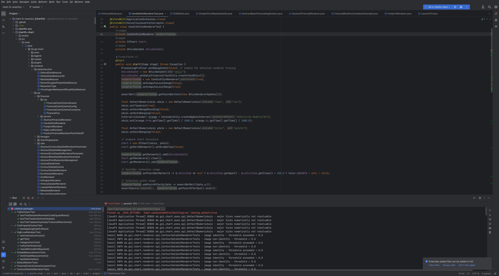
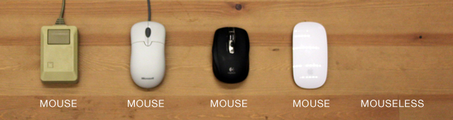

# intellij-idea-cz
<!--ts-->
* [intellij-idea-cz](#intellij-idea-cz)
* [Intro](#intro)
   * [Intellij IDEA](#intellij-idea)
   * [JetBrains](#jetbrains)
   * [Cíl článku](#cíl-článku)
   * [Klávesové zkratky](#klávesové-zkratky)
      * [Jak si zapamatovat velké množství zkratek?](#jak-si-zapamatovat-velké-množství-zkratek)
   * [Intellij IDEA Dokumentace](#intellij-idea-dokumentace)
* [UI Theme](#ui-theme)
   * [NewUI JetBrains Theme](#newui-jetbrains-theme)
      * [Ukázka přidávání důležitých widgetů](#ukázka-přidávání-důležitých-widgetů)
   * [Monokai Pro](#monokai-pro)
   * [Dracula Theme](#dracula-theme)
* [Ergonomic Keybindings (Mouseless)](#ergonomic-keybindings-mouseless)
   * [Mouseless přístup](#mouseless-přístup)
   * [Navigace](#navigace)
      * [Bookmark navigace (RTS přístup)](#bookmark-navigace-rts-přístup)
   * [Čtení kódu](#čtení-kódu)
   * [Debug](#debug)
      * [Remote Debug](#remote-debug)
   * [Psaní kódu](#psaní-kódu)
   * [Práce s editorem](#práce-s-editorem)
   * [Refactoring](#refactoring)
   * [Plugins](#plugins)
* [Pro Tips](#pro-tips)
   * [Code analysis](#code-analysis)
      * [Dependency Structure Matrix](#dependency-structure-matrix)
      * [Structural search and replace](#structural-search-and-replace)
   * [Compare](#compare)
      * [Compare with Clipboard](#compare-with-clipboard)
   * [Multi-selection](#multi-selection)
   * [Regex](#regex)
   * [Run Tests with Coverage](#run-tests-with-coverage)
   * [In-Build Profiler (Ultimate Edition)](#in-build-profiler-ultimate-edition)
   * [Vestavěná podpora pro vývoj a nasazení kontejnerizovaných aplikací pomocí Dockeru](#vestavěná-podpora-pro-vývoj-a-nasazení-kontejnerizovaných-aplikací-pomocí-dockeru)
* [Jiné světy](#jiné-světy)

<!-- Created by https://github.com/ekalinin/github-markdown-toc -->
<!-- Added by: box, at: Sat Jun  7 10:17:38 AM CEST 2025 -->

<!--te-->
# Intro

## Intellij IDEA

IntelliJ IDEA je výkonné a oblíbené integrované vývojové prostředí (IDE) pro vývoj softwaru. Je široce používané vývojáři Java a Kotlinu, ale podporuje také řadu dalších programovacích jazyků včetně Pythonu, C++, Lua a dalších. 

Jednou z klíčových vlastností IntelliJ IDEA je pokročilá navigace v kódu a možnosti refaktorování. IDE obsahuje výkonný editor kódu, který poskytuje pokročilé dokončování kódu, zvýraznění chyb a kontroly kódu. Kromě toho IDE obsahuje řadu nástrojů pro refaktorování, jako je „Extract Method“ a „Rename“, které usnadňují bezpečnou a efektivní úpravu kódu. 

Další důležitou vlastností IntelliJ IDEA je jeho vestavěná podpora pro různé systémy správy verzí. IDE podporuje Git, SVN a Mercurial a usnadňuje správu změn kódu a spolupráci s dalšími vývojáři. Kromě toho IDE obsahuje vestavěný merge tool, který usnadňuje porovnávání změn kódu, a řadu slučovacích nástrojů, které mohou pomoci vyřešit konflikty. 

Jednou z nejoblíbenějších funkcí IntelliJ IDEA je vestavěná podpora pro vývoj aplikací Java. IDE obsahuje výkonný Java debugger, editor vizuálního rozvržení pro vytváření uživatelských rozhraní JavaFX a řadu bundled rozšíření zejména v placené úrovni Ultimate. IntelliJ IDEA navíc poskytuje podporu pro vývoj aplikací Spring a Spring Boot. 

IntelliJ IDEA také poskytuje širokou škálu nástrojů pro vývoj webových aplikací. IDE obsahuje vestavěný webový prohlížeč, vizuální HTML a CSS editor a JavaScript debugger. Kromě toho IDE podporuje různé webové frameworky, jako je AngularJS, ReactJS a VueJS. Nicméně se jedná o základní podporu. Pro všestranou implementaci je lepší zvolit WebStorm.

Kromě pokročilých vývojových schopností IntelliJ IDEA obsahuje také řadu dalších funkcí, které z něj dělají výkonné a všestranné IDE. Některé z těchto funkcí zahrnují: 

* Přizpůsobitelné rozhraní a klávesové zkratky 
* Vestavěná podpora pro různé pluginy a rozšíření 
* Vestavěný terminál a rozhraní příkazového řádku 
* Vestavěná podpora pro vzdálený vývoj a nasazení 
* Vestavěná podpora pro vývoj a nasazení kontejnerizovaných aplikací pomocí Dockeru 

IntelliJ IDEA je výkonné a všestranné IDE, které poskytuje pokročilou navigaci v kódu a možnosti refaktorování, vestavěnou podporu pro různé systémy správy verzí a podporu pro vývoj široké škály aplikací využívajících různé jazyky a frameworky. Díky rozsáhlé sadě funkcí a přizpůsobitelnému rozhraní je IntelliJ IDEA dokonalou volbou pro pokročilé vývojáře.

## JetBrains

**JetBrains** je společnost zabývající se vývojem softwaru, která je nejvíce známá pro své oblíbené produkty integrovaného vývojového prostředí (IDE), jako jsou IntelliJ IDEA, PyCharm a WebStorm. Společnost JetBrains, založená v roce 2000, se stala předním poskytovatelem inteligentních vývojových nástrojů pro programátory a vývojáře po celém světě. 

Jedním z nejoblíbenějších produktů nabízených JetBrains je **IntelliJ IDEA**, výkonné a všestranné IDE pro vývoj v Javě a Kotlinu, viz výše.

Dalším oblíbeným produktem nabízeným JetBrains je **PyCharm**, vyhrazené IDE pro vývoj Pythonu. PyCharm poskytuje širokou škálu funkcí pro vývoj Pythonu, včetně dokončování kódu (code completion), zvýrazňování chyb a kontrol kódu. Kromě toho IDE obsahuje výkonný Python debugger, editor vizuálního rozvržení pro vytváření uživatelských rozhraní PyQt a Tkinter UI a podporu pro vytváření a nasazování aplikací Python. 

**WebStorm** je další produkt JetBrains, který je zaměřen na webové vývojáře. WebStorm poskytuje širokou škálu nástrojů pro vývoj webových aplikací, včetně vestavěného webového prohlížeče, vizuálního HTML a CSS editoru a JavaScript debuggeru. Kromě toho IDE podporuje různé webové frameworky, jako je AngularJS, ReactJS a VueJS, což z něj činí ideální nástroj pro vývoj webu. 

Kromě oblíbených produktů IDE nabízí JetBrains také řadu dalších vývojových nástrojů, včetně **TeamCity**, serveru pro continuous integration a delivery server, **YouTrack**, nástroje pro sledování ticketů (issue tracking) a řízení projektů (project management tool). Tyto nástroje jsou navrženy tak, aby zvýšily produktivitu a spolupráci vývojových týmů a usnadnily jim vytváření a nasazení vysoce kvalitního softwaru. 

Kromě svých produktových nabídek je JetBrains známý také svým závazkem vůči vývojářské komunitě. Společnost pravidelně vydává aktualizace a nové funkce pro své produkty a aktivně spolupracuje s vývojáři prostřednictvím svých fór a kanálů sociálních médií. JetBrains také nabízí různé vzdělávací zdroje, jako jsou výukové programy a webové semináře, které vývojářům pomohou zlepšit jejich dovednosti a zůstat v obraze s nejnovějším vývojem v softwarovém průmyslu. 

JetBrains je soukromá společnost, což znamená, že vlastnická struktura a **finanční podrobnosti společnosti nejsou veřejně zveřejňovány**. Je však známo, že společnost byla založena v roce 2000 v Praze v České republice třemi vývojáři: Sergey Dmitriev, Valentin Kipyatkov a Eugene Belyaev. Od svého založení společnost rostla a expandovala a nyní má několik kanceláří umístěných v různých částech světa. 

JetBrains má několik poboček po celém světě, včetně centrály v Praze v České republice a regionálních kanceláří v Petrohradě v Rusku (toto již neplatí, díky [válce s Ukrajinou](https://blog.jetbrains.com/blog/2022/12/06/update-on-jetbrains-statement-on-ukraine/);  Mnichov, Německo; a Boston, Spojené státy americké. Tyto kanceláře jsou odpovědné za prodej, marketing a podporu produktů společnosti ve svých příslušných regionech. Kromě toho má JetBrains také výzkumnou a vývojovou kancelář v Novosibirsku v Rusku, která je zodpovědná za vývoj nových produktů a funkcí (toto již také neplatí, detaily změn zatím neznám). 

JetBrains je známý svým závazkem vůči své komunitě a poskytuje služby profesionálního rozvoje a školení. Společnost má širokou škálu zákazníků, včetně velkých podniků, malých a středních podniků a individuálních vývojářů. JetBrains také nabízí licence pro své produkty v rámci různých plánů, jako jsou osobní, komerční, akademické a open-source projekty. 

Kromě toho má JetBrains silný partnerský program se společnostmi a organizacemi, jako jsou GitHub, Microsoft, Oracle a mnoho dalších. Tato partnerství pomáhají JetBrains zůstat v obraze s nejnovějším vývojem v oboru a poskytují lepší integraci s dalšími nástroji a technologiemi. 

JetBrains je předním poskytovatelem inteligentních vývojových nástrojů pro programátory a vývojáře po celém světě. Jeho oblíbené produkty, jako jsou IntelliJ IDEA, PyCharm a WebStorm, se staly nezbytnými nástroji pro mnoho vývojářů a jeho závazek vůči vývojářské komunitě z něj udělal důvěryhodné jméno v odvětví vývoje softwaru. Díky široké škále funkcí a závazku ke kvalitě má JetBrains dobrou pozici k tomu, aby i nadále poskytovala výkonné a efektivní vývojové nástroje po mnoho dalších let (doufejme). 

## Cíl článku

Tento článek je součástí automatického generování pro Github Geek-Room project. Jedná se o rolling článek, dynamicky rozvíjený o nové poznatky a nápady. Aktualizace článku je uvedena v horní tabulce. Článek nepokrývá základní dovednosti s Intellij IDEA, spíše dává odkazy na důležité webové zdroje, které jsou z hlediska používání IDEA velmi důležité neminout. Naopak se soustředí na **pokročilejší techniky, ovládání a zefektivnění práce** v tomto IDE.

## Klávesové zkratky

Klávesové zkratky jsou vázány na používaný systém a subsystém. V Intellij IDEA dokumentaci je možné je přepnout vpravo nahoře. V tomto článku budeme používat `XWin` klávesové zkratky.

### Jak si zapamatovat velké množství zkratek?

Úplně stejně jako hraní na hudební nástroj, cvičení bojového umění, plavání, nebo tanec. Trvá delší dobu se je naučit, pohyb je však uchováván dlouhodobě a již málokdy je zapomenut. Lze jej velmi rychle automatizovat a zrychlit. Toto NIKDY nelze udělat s ovládáním myší.

## Intellij IDEA Dokumentace

Dokumentace, ve které se najdou zajímavé informace. Nejedná se pouze o informace pro začátečníky, ale obsahuje popis pokročilých funkcí a rozšíření.

Podívejte se například na `Pro Tips`, `Analysis` a `Integrated Tools` / `Big Data Tools`.

* https://www.jetbrains.com/help/idea/2022.3/getting-started.html - Get Started, full documentation
* https://www.jetbrains.com/idea/guide/ - Tips and Tutorials
* https://www.jetbrains.com/help/ - základní rozcestník všech produktů JetBrains na tutorials a dokumentace

# UI Theme

https://www.jetbrains.com/help/idea/user-interface-themes.html?keymap=primary_xwin#tips

Volba schématu a zvolení grafických prvků patří k důležitým faktorům používání Intellij IDEA. **Darkula** Základní používání každý určitě zná a používá. Zde budou uvedeny jiné varianty, které nabízejí další zajímavá a možná i Vaše budoucí řešení.

## NewUI JetBrains Theme

https://www.jetbrains.com/help/idea/new-ui.html

* Nové UI se snaží jít cestou minimalismu. 
* Snaží se zvýrazňovat barevně akční prvky, které uživatel často používá. 
* Dochází ke schování prvků, dokud uživatel na daný panel "nenajede".
* Umísťování vlastních widgetů, tlačítek na panely, vytváření skriptů.
* `BETA` Zatím beta, nemožnost měnit barevné schéma, nelze měnit velikost widgetů, není integrováno s pluginy atd.

### Ukázka přidávání důležitých widgetů

## Monokai Pro

https://monokai.pro/

* Jedno z nejlepších schémat současnosti. (Další možnosti OneDark, MonokaiPro, Dracula, Nord, Gruvbox).
* Kvalitní čtení, soustředění se na důležité klíčové prvky jazyka, rozsáhlé rozšíření barevných elementů.
* Stále šetrné na oči.

## Dracula Theme

Zeno Rocha
* https://draculatheme.com
* https://draculatheme.com/pro

  
  

* Velmi populární téma. 
* Jednoduchá integrace do celého systému.
* Varianty Dracula PRO (placená verze) má "dokonale" balancovaný kruh barev.
* Některé unavené oči již mohou vnímat nekomfort, nutné tlumení svítivosti LCD panelu.

# Ergonomic Keybindings (Mouseless)

Přístup „bez myši“ (mouseless) se týká používání klávesových zkratek a příkazů místo myši k navigaci a interakci s aplikací. V IntelliJ IDEA můžete používat různé klávesové zkratky k provádění běžných akcí, jako je navigace mezi soubory, úprava kódu a spouštění příkazů. Seznam dostupných klávesových zkratek naleznete v nabídce `Nápověda > Výchozí reference mapy kláves` nebo vyhledáním výrazu `keymap` v nastavení. Mnoho zkratek je přizpůsobitelných a můžete si také vytvořit své vlastní zkratky. IntelliJ IDEA má navíc funkci zvanou `„Rychlý přístup“`, která vám umožňuje rychle přejít na konkrétní soubor, nastavení nebo akci zadáním několika písmen. Rychlý přístup získáte stisknutím <kbd>ctrl + shift + a</kbd> na Windows/Linux nebo <kbd>cmd + shift + a</kbd> na Macu. Pomocí klávesových zkratek a příkazů můžete procházet a provádět akce v IntelliJ IDEA bez použití myši, což vám může pomoci pracovat efektivněji a snížit námahu vašich rukou a citelné zabránění syndromu karpálního tunelu.

## Mouseless přístup

* **Zvýšená efektivita:** Používání klávesových zkratek a příkazů umožňuje rychlejší navigaci a provádění akcí v aplikaci, což vám může pomoci pracovat efektivněji. 
* **Snížené zdravotních problémů způsobené opakovanou námahou:** Používání myši po dlouhou dobu může zatěžovat vaši ruku a zápěstí, což může vést ke zdravotním problémům s opakovanou námahou, jako je syndrom karpálního tunelu. Použití klávesových zkratek a příkazů místo toho může pomoci snížit toto namáhání. 
* **Lepší pohodlí:** Když používáte klávesové zkratky a příkazy, můžete mít ruce v přirozenější a pohodlnější poloze, což může pomoci snížit nepohodlí a únavu. 

Syndrom karpálního tunelu (CTS = Carpal Tunnel Syndrome) je běžný stav, který postihuje ruku a zápěstí. Je způsobena kompresí n. medianus, který prochází karpálním tunelem v zápěstí. Příznaky CTS zahrnují bolest, necitlivost, brnění a slabost v ruce a prstech. Je to způsobeno opakovaným pohybem, dlouhodobým držením nástrojů nebo dlouhodobým používáním počítačové myši. Je také běžné u lidí s cukrovkou nebo jinými zdravotními stavy, které postihují ruku nebo zápěstí. 

CTS lze léčit odpočinkem, dlahami a fyzikální terapií. V některých případech může vyžadovat chirurgický zákrok. Nejlepším způsobem prevence CTS je dělat pravidelné přestávky při práci na počítači nebo používání myši, protahování a cvičení rukou a zápěstí a používání ergonomického vybavení a technik. 

## Navigace

* <kbd>ctrl + left/right</kbd> - pohyb po slovech; rychlá a efektivní navigace v rámci jedné řádky. Pozn.: <kbd>ctrl + Up/Down</kbd> - standardní scrolling bez myši.
* <kbd>alt + up/down</kbd> - skákání po názvech metod a elementech.
* <kbd>ctrl + alt + left/right</kbd> - předchozí/následující pozice kurzoru v historii (pohyb rovněž mezi soubory).
* <kbd>ctrl + shift + up/down</kbd> - posun vybraného textu nahoru/dolů se auto zarovnáním dle kódu.
* <kbd>shift + enter</kbd> - vytvoření nové řádky se zachováním stavu aktuální řádky.
* <kbd>ctrl + shift + enter</kbd> - přidání středníku na správné místo za příkazem. Doporučuji přidat custom zkratku <kbd>ctrl + ;</kbd>
* <kbd>ctrl + shift + backspace</kbd> - poslední editovaná pozice.
* <kbd>ctrl + F12</kbd> - [struktura aktuálního souboru](https://www.jetbrains.com/help/idea/viewing-structure-of-a-source-file.html).
* <kbd>ctrl + b</kbd>, <kbd>ctrl + left_click</kbd> - **deklarace a použití daného výrazu**
* <kbd>ctrl + h</kbd> - hierarchie typu
* <kbd>ctrl + shift + t</kbd> - **skok do junit testu dané třídy**
* <kbd>F2</kbd>, <kbd>shift + F2</kbd> - skok po chybách

### Bookmark navigace (RTS přístup)
* <kbd>ctrl + shift + numbers</kbd> - založení bookmarks číselných
* <kbd>ctrl + numbers</kbd> - skákání dle bookmark čísel
* <kbd>alt + 2</kbd> - panel s **bookmarks**, přehled, mazání, organizace
* <kbd>alt + 1</kbd> - project panel
* <kbd>alt + 4</kbd> - run panel
* <kbd>alt + 0</kbd> - git commit panel (pokud aktivní panel mode)

## Čtení kódu

* <kbd>shift + shift</kbd> - Hledat všude! <kbd>ctrl + n</kbd> - rychlé hledání class, možno přepínat na all, files, actions atd. <kbd>ctrl + shift + n</kbd> - stejné ale hned na soubory!
* <kbd>ctrl + shift + f</kbd> - [Hledání textu všude](https://www.jetbrains.com/help/idea/finding-and-replacing-text-in-project.html). **Dopoučuji si pořádně projít speciality.** CamelCase, regexp apod.

## Debug

* <kbd>alt + F8</kbd> - Evaluate expression... Možnost více řádkového zpracování. <kbd>alt + v</kbd> - evaluate výraz
* Drop Frame - ikonka papíru s křížek levém horním roku. V debugu nechtěně přeskočíte důležitou řádku, zahodíte frame a můžete udělat cyklus znovu!

### Remote Debug
* https://www.jetbrains.com/help/idea/tutorial-remote-debug.html
* ssh tunnel na local port: `ssh -f box@domain.cz -NL 5005:127.0.0.1:5005`

## Psaní kódu

* <kbd>ctrl + space</kbd> - esenciální inteligentní našeptávač z aktuální pozice kurzoru
* <kbd>ctrl + p</kbd> - zobrazení parametrů, doplňkových informací a datových typů u metody
* <kbd>alt + enter</kbd> - inteligentní akce dle aktuálního kontextu
* <kbd>alt + insert</kbd> - generovat základní metody, **testy**
* <kbd>ctrl + alt + j</kbd> - na proměnné, **Iterable**
* <kbd>ctrl + alt + t</kbd> - surround with...
* <kbd>ctrl + alt + o</kbd> - optimize imports, možno ale nastavit on-the-fly v nastavení, spíše ale řeší `spotless` plugin
* <kbd>ctrl + alt + l</kbd> - format code according to your defined formatter
* `Live Templates` - konfigurace v File → Settings → Editor → Live template

## Práce s editorem

* <kbd>ctrl + shift + F12</kbd> - **soustředit se pouze na kód**, schovat všechna okna
* <kbd>ctrl + x</kbd> - smazat řádku
* <kbd>ctrl + d</kbd> - duplikovat řádku. Já přemapovávám na <kbd>ctrl + y</kbd>
* <kbd>ctrl + shift + v</kbd> - multicliboard (pouze v idea). Používám nativní multi-clipboards.
* <kbd>alt + left_click držet</kbd> - sloupcový kurzor výběr, výmaz nebo editování sloupců, click vedle jej zruší
* <kbd>ctrl + shift + F10</kbd> - spustit zvolený test metodu, třídu nebo vybranou složku testů pod kurzorem.
* <kbd>ctrl + F2</kbd> - zastavit, stopnout aktuální test
* <kbd>ctrl + F5</kbd> - spustit aktuální zvolenou releaci v Run

## Refactoring

* <kbd>ctrl + alt + M/V/C</kbd> - refactorovat metodu, proměnnou (variable), konstantu (constant)
* <kbd>shift + F6</kbd> - přejmenování elementu
* <kbd>ctrl + shift + F6</kbd> - migrace typu
* <kbd>ctrl + shift + a</kbd> - raději používám actions a najít příkaz, který chci...

## Plugins

* `Maven Helper` - Dependency Hierarchy Tree Analysis, Excludes a další
* `SonarLint, ESLinet` - Linty, kontrola čistoty kódu
* `Key Promoter` - rádce pro zkratky, nepoužívám, ale může se asi hodit ze začátku...
* `Color Highlighter` - zvýrazňování rgb barev
* `AI Coding Assistant` - integrace s OpenAI, zatím začátek...

# Pro Tips

## Code analysis

### Dependency Structure Matrix

`Code -> Analyze Code -> Dependency Matrix...`

IntelliJ IDEA vám umožňuje analyzovat, jak úzce na sobě komponenty ve vašem kódu závisí, a musíte si to dávat pozor, protože když je závislostí příliš mnoho, pravděpodobně to způsobí různé problémy. Akce Matice struktury závislostí (dostupná prostřednictvím nabídky `Analyzovat`) vám pomůže vizualizovat a prozkoumat závislosti mezi moduly, balíčky a třídami. 

### Structural search and replace

https://www.jetbrains.com/idea/docs/ssr.pdf

Structural Search and Replace neboli SSR je poměrně výkonný (až se jej naučíte správně používat) a lze jej použít pro analýzu statického kódu a automatizaci refaktoringu. Stručně řečeno, umožňuje vám vyhledávat konkrétní vzory ve vašem kódu a nahradit je parametrizovanými šablonami. K tomu je vybaven vlastním jazykem pro definování vzorů kódu, který je podrobněji popsán v článku uvedený výše.

Pro přístup k této funkci použijte tlačítko `Edit -> Find -> Search/Replace Structurally...` Pokud chcete vytvořit své šablony nebo vzory, přejděte do dialogu `Settings`, klikněte na stránku `Editor | Inspections` a povolte kontrolu strukturního vyhledávání v `General`.

## Compare

### Compare with Clipboard

* `View | Compare with Clipboard` - porovnání aktuálního pohledu, selekce, souboru s obsahem schránky.

## Multi-selection

* <kbd>alt + j</kbd> - stiskl vícekrát, označuje postupně daný výskyt, lze potom psát paralelně, dynamicky.

## Regex

Regulární výrazy jsou mocné a široce používané, ale někdy je prostě příliš těžké je správně napsat. IntelliJ IDEA vám pomůže zkontrolovat jakýkoli Regex ve vašem kódu: stačí na něj umístit kurzor a stisknout <kbd>alt + enter</kbd>. 

## Run Tests with Coverage

* `More Run/Debug -> Run Tests XYZ with Coverage` - Možnost ověřit coverage pro konkrétní spuštěné testy, aktualizovat coverage tabulku, nebo ji vyčistit a zjistit nové pokrytí. 

## In-Build Profiler (Ultimate Edition)

* `More Run/Debug -> Run XYZ with Intellij Profiler` - Hned pod coverage se nachází profiler integrovaný do Intellij IDEA.

## Vestavěná podpora pro vývoj a nasazení kontejnerizovaných aplikací pomocí Dockeru

IntelliJ IDEA poskytuje integrovanou podporu pro vývoj a nasazení kontejnerizovaných aplikací pomocí Dockeru. Tato funkce umožňuje vývojářům snadno vytvářet, spouštět a ladit kontejnery Docker přímo z IDE. 

Jedním ze způsobů použití této funkce je instalace pluginu Docker pro IntelliJ IDEA. Po instalaci pluginu mohou vývojáři přistupovat k oknu nástroje Docker z IDE. Toto okno nástroje poskytuje řadu funkcí pro práci s Dockerem, včetně možnosti prohlížet a spravovat spuštěné kontejnery, zobrazovat a spravovat images a vytvářet a spouštět nové kontejnery. 

K vytvoření nového kontejneru mohou vývojáři použít funkci "Vytvořit kontejner" v okně nástroje Docker. Tato funkce umožňuje vývojářům určit image, který se má použít pro kontejner, nakonfigurovat proměnné prostředí a určit porty, které se mají vystavit. Jakmile je kontejner vytvořen, lze jej spustit a zastavit přímo z IDE. 

Dalším způsobem, jak využít vestavěnou podporu pro Docker, je použití podpory Docker Compose. To umožňuje vývojářům definovat a spouštět vícekontejnerové aplikace pomocí jediného `docker-compose.yml` soubor. IDE automaticky stáhne potřebné obrázky a spustí definované kontejnery, což usnadňuje nastavení a spouštění složitých aplikací. 

IntelliJ IDEA navíc umožňuje vývojářům spouštět a ladit aplikace uvnitř kontejneru a také poskytuje možnost spouštět a ladit aplikace ve vzdáleném kontejneru pomocí funkce `Remote Debugging`. Tato funkce umožňuje vývojářům připojit debugger IDE k běžícímu kontejneru a procházet kód, nastavovat body přerušení a kontrolovat proměnné, jako by aplikace běžela lokálně. 

Stručně řečeno, integrovaná podpora pro Docker v IntelliJ IDEA umožňuje vývojářům snadno vytvářet, spouštět a ladit kontejnery Docker přímo z IDE pomocí okna nástroje Docker nebo podpory Docker Compose. Tato funkce zefektivňuje proces vývoje a usnadňuje práci s kontejnerovými aplikacemi.

# Jiné světy

IntelliJ IDEA je výkonné a na funkce bohaté integrované vývojové prostředí (IDE), které je široce používáno vývojáři Java a Kotlinu. Existují však i další dostupné nástroje, které mohou v určitých situacích nabízet výhody oproti IntelliJ IDEA. **Neovim** a **Visual Studio Code (VS Code)** jsou dva takové nástroje, které mohou vývojářům poskytnout odlišné a v některých případech efektivnější vývojové zkušenosti. 

**Neovim** je fork populárního textového editoru Vim s přidanými funkcemi a vylepšeními, pracují s jazykem Lua. Jednou z hlavních výhod Neovimu je jeho vysoká úroveň přizpůsobitelnosti. Neovim umožňuje vývojářům konfigurovat téměř každý aspekt editoru, od klávesových vazeb po barevná schémata. Tato úroveň flexibility může vývojářům pomoci pracovat efektivněji a pohodlněji. Neovim má vynikající ovládání pomocí klávesnice, které bylo za léta používání dovedeno k dokonalosti, toto často bývá jeden z nejdůležitějších faktorů pro jeho používání. Kromě toho má Neovim velkou komunitu uživatelů a vývojářů, což znamená, že je k dispozici mnoho zdrojů a pluginů, které vývojářům pomohou co nejlépe využít editor. 

Další výhodou Neovimu je jeho výkon. Neovim je navržen tak, aby byl rychlý a lehký, takže je skvělou volbou pro vývojáře, kteří pracují na velkých projektech nebo s velkými soubory. Integrace terminálu Neovim navíc umožňuje vývojářům bezproblémově pracovat s nástroji příkazového řádku, což z něj dělá skvělou volbu pro vývojáře, kteří preferují pracovní postup založený na terminálu. 

Na druhé straně **VS Code** je bezplatný editor kódu s otevřeným zdrojovým kódem pro více platforem vyvinutý společností Microsoft. Má velký ekosystém rozšíření a podporuje více programovacích jazyků. Jednou z hlavních výhod VS Code je jeho rozšiřitelnost, které je dosaženo díky bohaté sadě API a rozsáhlé knihovně rozšíření. Tato rozšíření mohou do editoru přidat nové funkce, jako je zvýraznění syntaxe, debugging a code completion. Díky tomu je VS Code skvělou volbou pro vývojáře, kteří potřebují pracovat s více jazyky nebo technologiemi. Podporuje širokou škálu jazyků a technologií, včetně JavaScriptu, TypeScriptu, Pythonu a Lua, a také podporuje ladění pomocí populárních frameworků, jako jsou React a Angular. 

Jednou z hlavních výhod Neovim a Visual Studio Code je jejich podpora pro **jazykový serverový protokol (LSP)**. LSP je protokol pro poskytování funkcí specifických pro jazyk, jako je code completion, informace o umístění kurzoru a ladění, textovým editorům a IDE. 

LSP funguje tak, že jazykový server, což je samostatný proces, který rozumí jazyku, komunikuje s textovým editorem nebo IDE prostřednictvím LSP. Textový editor nebo IDE odesílá požadavky na jazykový server, jako jsou požadavky na dokončení kódu nebo informace o umístění kurzoru, a jazykový server odpoví příslušnými informacemi. Tento přístup umožňuje oddělení problémů mezi textovým editorem nebo IDE a funkcí specifickou pro daný jazyk, což může vést k řadě výhod. 

Jednou z hlavních výhod LSP je, že umožňuje vysokou úroveň konzistence napříč různými textovými editory a IDE. Vzhledem k tomu, že funkce specifické pro daný jazyk jsou poskytovány samostatným procesem, různé textové editory a IDE mohou používat stejný jazykový server, což znamená, že stejné budou dostupné bez ohledu na použitý textový editor nebo IDE. 

Další výhodou LSP je, že umožňuje snadnější vývoj a údržbu funkcí specifických pro daný jazyk. S LSP je funkce specifická pro daný jazyk oddělena od textového editoru nebo IDE, což znamená, že se vývojáři mohou soustředit na vývoj jazykového serveru a nemusí se starat o textový editor nebo detaily specifické pro IDE. 

A konečně, LSP také umožňuje lepší výkon, protože jazykový server běží v samostatném procesu, může využívat více jader, může používat více paměti a může být optimalizován pro daný jazyk. 

Stručně řečeno, podpora LSP v Neovim a VS Code umožňuje vysokou úroveň konzistence napříč různými textovými editory a IDE, snadný vývoj a údržbu funkcí specifických pro daný jazyk a lepší výkon. 

Zatímco IntelliJ IDEA je výkonné a na funkce bohaté IDE, vývojáři mohou zjistit, že **Neovim** a **VS Code** nabízejí v určitých situacích výhody. Vysoká úroveň přizpůsobitelnosti a výkonu Neovimu z něj činí skvělou volbu pro vývojáře, kteří preferují pracovní postup založený na terminálu. A rozšiřitelnost VS Code z něj dělají skvělou volbu pro vývojáře, kteří potřebují pracovat s více jazyky nebo technologiemi. Vývojáři by měli zvážit možnost vyzkoušet Neovim a VS Code jako alternativu k jejich současnému vývojovému prostředí, aby zjistili, zda jim může pomoci pracovat efektivněji a pohodlněji. 
