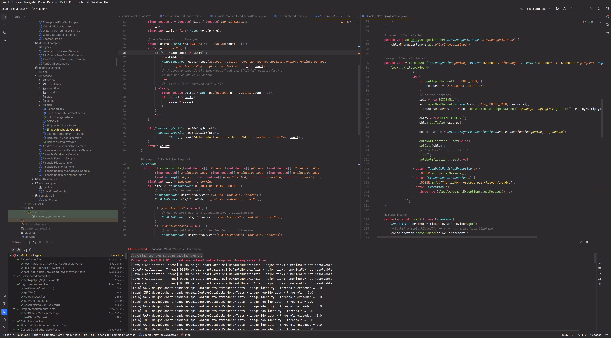
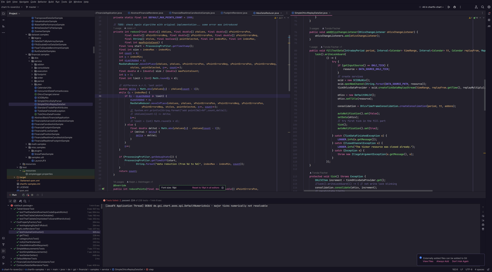
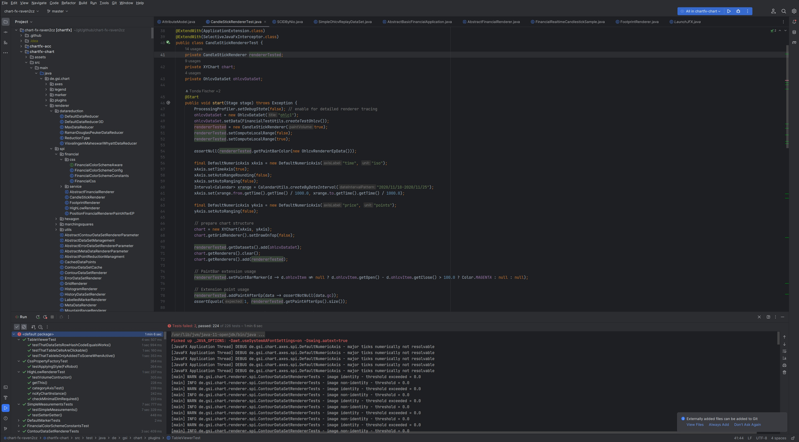

# intellij-idea

<!--ts-->
* [intellij-idea](#intellij-idea)
* [Intro](#intro)
   * [Intellij IDEA](#intellij-idea-1)
   * [JetBrains](#jetbrains)
* [UI](#ui)
* [Ergonomic (Mouseless)](#ergonomic-mouseless)
* [Pro Tips](#pro-tips)
   * [Built-in support for developing and deploying containerized applications using Docker](#built-in-support-for-developing-and-deploying-containerized-applications-using-docker)
* [Another Worlds](#another-worlds)

<!-- Added by: box, at: Fri Nov 17 07:38:07 PM CET 2023 -->

<!--te-->

# Intro

## Intellij IDEA

IntelliJ IDEA is a powerful and popular Integrated Development Environment (IDE) for developing software. It is widely used by Java developers, but also supports a variety of other programming languages including Python, C++, and Kotlin.

One of the key features of IntelliJ IDEA is its advanced code navigation and refactoring capabilities. The IDE includes a powerful code editor that provides advanced code completion, error highlighting, and code inspections. Additionally, the IDE includes a variety of refactoring tools, such as "Extract Method" and "Rename," that make it easy to safely and efficiently modify code.

Another important feature of IntelliJ IDEA is its built-in support for a variety of version control systems. The IDE supports Git, SVN, and Mercurial, and makes it easy to manage code changes and collaborate with other developers. Additionally, the IDE includes a built-in diff viewer that makes it easy to compare code changes, and a variety of merge tools that can help resolve conflicts.

One of the most popular features of IntelliJ IDEA is the built-in support for developing Java applications. The IDE includes a powerful Java debugger, a visual layout editor for building JavaFX and Swing UIs, and support for building and deploying Java applications to various platforms. Additionally, IntelliJ IDEA provides support for developing Spring and Spring Boot applications.

IntelliJ IDEA also provides a wide range of tools for developing web applications. The IDE includes a built-in web browser, a visual HTML and CSS editor, and a JavaScript debugger. Additionally, the IDE supports a variety of web frameworks such as AngularJS, ReactJS, and VueJS.

In addition to its advanced development capabilities, IntelliJ IDEA also includes a variety of other features that make it a powerful and versatile IDE. Some of these features include:

* Customizable interface and keybindings
* Built-in support for a variety of plugins and extensions
* Built-in terminal and command-line interface
* Built-in support for remote development and deployment
* Built-in support for developing and deploying containerized applications using Docker

In conclusion, IntelliJ IDEA is a powerful and versatile IDE that provides advanced code navigation and refactoring capabilities, built-in support for a variety of version control systems, and support for developing a wide range of applications using different languages and frameworks. With its extensive feature set and customizable interface, IntelliJ IDEA is the perfect choice for advanced developers looking to streamline their development workflow and improve their productivity.

## JetBrains

JetBrains is a software development company that is best known for its popular Integrated Development Environment (IDE) products, such as IntelliJ IDEA, PyCharm, and WebStorm. Founded in 2000, JetBrains has become a leading provider of intelligent development tools for programmers and developers worldwide.

One of the most popular products offered by JetBrains is IntelliJ IDEA, a powerful and versatile IDE for Java development. IntelliJ IDEA is known for its advanced code navigation and refactoring capabilities, built-in support for a variety of version control systems, and support for developing a wide range of applications using different languages and frameworks. It has a wide range of features that make it a powerful and versatile IDE, making it a perfect choice for advanced developers looking to streamline their development workflow and improve their productivity.

Another popular product offered by JetBrains is PyCharm, a dedicated IDE for Python development. PyCharm provides a wide range of features for Python development, including code completion, error highlighting, and code inspections. Additionally, the IDE includes a powerful Python debugger, a visual layout editor for building PyQt and Tkinter UIs, and support for building and deploying Python applications.

WebStorm is another JetBrains product that is aimed at web developers. WebStorm provides a wide range of tools for developing web applications, including a built-in web browser, a visual HTML and CSS editor, and a JavaScript debugger. Additionally, the IDE supports a variety of web frameworks such as AngularJS, ReactJS, and VueJS, making it an ideal tool for web development.

Beyond its popular IDE products, JetBrains also offers a variety of other development tools, including TeamCity, a continuous integration and delivery server, and YouTrack, an issue tracking and project management tool. These tools are designed to enhance the productivity and collaboration of development teams, making it easier for them to build and deploy high-quality software.

In addition to its product offerings, JetBrains is also known for its commitment to the developer community. The company regularly releases updates and new features for its products, and actively engages with developers through its forums and social media channels. JetBrains also offers a variety of educational resources, such as tutorials and webinars, to help developers improve their skills and stay up-to-date with the latest developments in the software industry.

JetBrains is a leading provider of intelligent development tools for programmers and developers worldwide. Its popular products, such as IntelliJ IDEA, PyCharm, and WebStorm, have become essential tools for many developers, and its commitment to the developer community has made it a trusted name in the software development industry. With a wide range of features and a commitment to quality, JetBrains is well-positioned to continue providing powerful and effective development tools for many years to come.

JetBrains is a privately held company, which means that the ownership structure and financial details of the company are not publicly disclosed. However, it is known that the company was founded in 2000 in Prague, Czech Republic by three developers: Sergey Dmitriev, Valentin Kipyatkov, and Eugene Belyaev. Since its founding, the company has grown and expanded, and now has several offices located in different parts of the world.

JetBrains has several branches around the world, including its headquarters in Prague, Czech Republic, and regional offices in St. Petersburg, Russia; Munich, Germany; and Boston, United States. These offices are responsible for sales, marketing, and support for the company's products in their respective regions. Additionally, JetBrains also has a research and development office in Novosibirsk, Russia, which is responsible for the development of new products and features.

JetBrains is known for its commitment to its community and provides professional development services and training. The company has a wide range of customers, including large enterprises, SMEs and individual developers. Also, JetBrains offers licenses for its products under different plans, such as personal, commercial, academic, and open-source projects.

In addition, JetBrains has a strong partnership program with companies and organizations such as GitHub, Microsoft, Oracle, and many others. These partnerships help JetBrains to stay up to date with the latest developments in the industry and provide better integration with other tools and technologies.

In summary, JetBrains is a privately held company that was founded in 2000 in Prague, Czech Republic. The company has grown significantly since its founding and now has branches and offices located in several countries around the world. JetBrains is committed to providing powerful and effective development tools for its customers, and is well-positioned to continue providing these tools for many years to come.

# UI

https://monokai.pro/

https://draculatheme.com/pro

https://www.jetbrains.com/help/idea/new-ui.html

# Ergonomic (Mouseless)

The "mouseless" approach refers to using keyboard shortcuts and commands instead of a mouse to navigate and interact with an application. In IntelliJ IDEA, you can use a variety of keyboard shortcuts to perform common actions, such as navigating between files, editing code, and running commands.

You can find a list of the available keyboard shortcuts by going to Help > Default Keymap Reference in the menu, or by searching for "keymap" in the settings. Many of the shortcuts are customizable, and you can also create your own custom shortcuts.

Additionally, IntelliJ IDEA has a feature called "Quick Access" which allows you to quickly navigate to a specific file, setting, or action by typing a few letters. You can access Quick Access by pressing Ctrl+Shift+A on Windows/Linux or Cmd+Shift+A on Mac.

You can also use the "find action" command by pressing Ctrl+Shift+A (Windows/Linux) or Cmd+Shift+A (Mac) this will open a dialog box where you can type the name of the action you want to perform and select it from the list.

By using keyboard shortcuts and command you can navigate and perform actions in IntelliJ IDEA without using the mouse, which can help you work more efficiently and reduce strain on your hands.

The mouseless approach

* Increased Efficiency: Using keyboard shortcuts and commands allows you to navigate and perform actions in an application more quickly, which can help you work more efficiently.

* Reduced Repetitive Strain Injury: Using a mouse for long periods of time can put strain on your hand and wrist, which can lead to repetitive strain injuries such as carpal tunnel syndrome. Using keyboard shortcuts and commands instead can help reduce this strain.

* Improved Comfort: When you use keyboard shortcuts and commands, you can keep your hands in a more natural and comfortable position, which can help reduce discomfort and fatigue.

Carpal Tunnel Syndrome (CTS) is a common condition that affects the hand and wrist. It is caused by compression of the median nerve, which runs through the carpal tunnel in the wrist. The symptoms of CTS include pain, numbness, tingling, and weakness in the hand and fingers. It is caused by repetitive motion, prolonged holding of vibrating tools, or prolonged use of a computer mouse. It is also common among people with diabetes or other medical conditions that affect the hand or wrist.

CTS can be treated with rest, splints, and physical therapy. In some cases, it may require surgery. The best way to prevent CTS is to take regular breaks when working on the computer or using a mouse, stretching and exercising your hands and wrists, and using ergonomic equipment and techniques.

# Pro Tips

## Built-in support for developing and deploying containerized applications using Docker

 IntelliJ IDEA provides built-in support for developing and deploying containerized applications using Docker. This feature allows developers to easily create, run, and debug Docker containers directly from within the IDE.

One way to use this feature is by installing the Docker plugin for IntelliJ IDEA. Once the plugin is installed, developers can access the Docker tool window from within the IDE. This tool window provides a variety of features for working with Docker, including the ability to view and manage running containers, view and manage images, and create and run new containers.

To create a new container, developers can use the "Create Container" feature in the Docker tool window. This feature allows developers to specify the image to use for the container, configure environment variables, and specify ports to expose. Once the container is created, it can be started and stopped directly from within the IDE.

Another way to use the built-in support for Docker is by using the Docker Compose support. This allows developers to define and run multi-container applications using a single `docker-compose.yml` file. The IDE will automatically download the necessary images and start the defined containers, making it easy to set up and run complex applications.

Additionally, IntelliJ IDEA allows developers to run and debug applications inside a container, it also provides the ability to run and debug application inside a remote container using the `Remote Debugging` feature. This feature allows developers to attach the IDE's debugger to a running container and step through the code, set breakpoints, and inspect variables as if the application was running locally.

In summary, the built-in support for Docker in IntelliJ IDEA allows developers to easily create, run, and debug Docker containers directly from within the IDE, using the Docker tool window or the Docker Compose support. This feature streamlines the development process and makes it easy to work with containerized applications.

# Another Worlds

IntelliJ IDEA is a powerful and feature-rich integrated development environment (IDE) that is widely used by Java developers. However, there are other tools available that may offer advantages over IntelliJ IDEA in certain situations. Neovim and Visual Studio Code (VS Code) are two such tools that can provide developers with a different, and in some cases, more efficient development experience.

Neovim is a fork of the popular Vim text editor, with added features and improvements. One of the main advantages of Neovim is its high level of customizability. Neovim allows developers to configure almost every aspect of the editor, from keybindings to color schemes. This level of flexibility can help developers work more efficiently and comfortably. Additionally, Neovim has a large community of users and developers, meaning that there are many resources and plugins available to help developers make the most of the editor.

Another advantage of Neovim is its performance. Neovim is designed to be fast and lightweight, making it a great choice for developers who work on large projects or with large files. Additionally, Neovim's terminal integration allows developers to work seamlessly with command-line tools, making it a great choice for developers who prefer a terminal-based workflow.

VS Code, on the other hand, is a free, open-source, cross-platform code editor developed by Microsoft. It has a large ecosystem of extensions and supports multiple programming languages. One of the main advantages of VS Code is its extensibility, which is achieved through its rich set of APIs and its large library of extensions. These extensions can add new functionality to the editor, such as syntax highlighting, debugging, and code completion. This makes VS Code a great choice for developers who need to work with multiple languages or technologies.

Another advantage of VS Code is its performance. VS Code is designed to be fast and lightweight, making it a great choice for developers who work on large projects or with large files. Additionally, VS Code's integrated terminal allows developers to work seamlessly with command-line tools, making it a great choice for developers who prefer a terminal-based workflow.

Finally, VS Code has a good debugging experience, which is a key feature for any developer. It supports a wide range of languages and technologies, including JavaScript, TypeScript, and Python, and it also supports debugging with popular frameworks such as React and Angular.

One of the main advantages of both Neovim and Visual Studio Code is their support for the Language Server Protocol (LSP). LSP is a protocol for providing language-specific features, such as code completion, hover information, and debugging, to text editors and IDEs.

LSP works by having a language server, which is a separate process that understands the language, communicate with the text editor or IDE through the LSP. The text editor or IDE sends requests to the language server, such as requests for code completion or hover information, and the language server responds with the appropriate information. This approach allows for a separation of concerns between the text editor or IDE and the language-specific functionality, which can lead to a number of advantages.

One of the main advantages of LSP is that it allows for a high level of consistency across different text editors and IDEs. Since the language-specific functionality is provided by a separate process, different text editors and IDEs can use the same language server, which means that the same features and functionality will be available regardless of the text editor or IDE being used.

Another advantage of LSP is that it allows for easier development and maintenance of language-specific features. With LSP, the language-specific functionality is separated from the text editor or IDE, which means that developers can focus on developing the language server, rather than having to worry about the text editor or IDE-specific details.

Finally, LSP also allows for better performance as the language server runs in a separate process, it can take advantage of multiple cores, it can use more memory and it can be optimized for the language.

In summary, the support for LSP in Neovim and VS Code allows for a high level of consistency across different text editors and IDEs, ease of development and maintenance of language-specific features and better performance.

While IntelliJ IDEA is a powerful and feature-rich IDE, developers may find that Neovim and VS Code offer advantages in certain situations. Neovim's high level of customizability and performance make it a great choice for developers who prefer a terminal-based workflow. And VS Code's extensibility and debugging experience make it a great choice for developers who need to work with multiple languages or technologies. Developers should consider trying Neovim and VS Code as an alternative to their current development environment to see if it can help them work more efficiently and comfortably.
