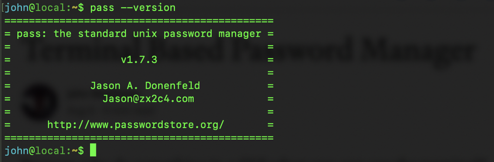
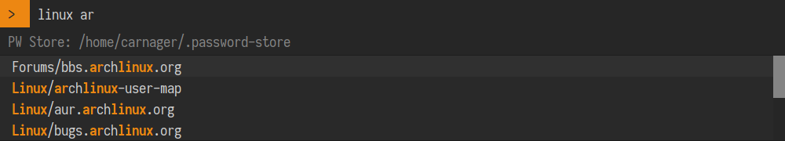
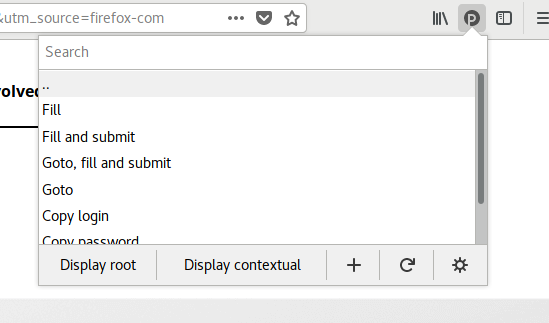
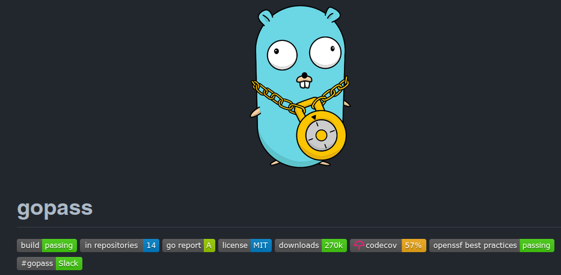

# pass-zx2c4

<!--ts-->
* [pass-zx2c4](#pass-zx2c4)
   * [Links](#links)
   * [Depends-On](#depends-on)
   * [What is and isn't PASS?](#what-is-and-isnt-pass)
      * [PASS is complicated! Just for geeks!](#pass-is-complicated-just-for-geeks)
   * [GnuPG Basics](#gnupg-basics)
   * [Pass Basics](#pass-basics)
      * [Directory Hierarchy](#directory-hierarchy)
      * [Syntax inside encrypted gpg file](#syntax-inside-encrypted-gpg-file)
      * [Fundamental commands](#fundamental-commands)
   * [Git Private Repo Integration](#git-private-repo-integration)
      * [Server-side](#server-side)
      * [Client-side](#client-side)
      * [Pass New Station Installation Steps](#pass-new-station-installation-steps)
   * [Rofi/dmenu Integration](#rofidmenu-integration)
   * [passff - Firefox Integration](#passff---firefox-integration)
   * [browserpass - Brave, Chromium, Firefox Integration](#browserpass---brave-chromium-firefox-integration)
   * [Password Store, OpenKeychain - Android Integration](#password-store-openkeychain---android-integration)
   * [Windows Integration - WSL2](#windows-integration---wsl2)
   * [Next Apps and Possibilities](#next-apps-and-possibilities)
   * [Pass - Credit &amp; License](#pass---credit--license)

<!-- Added by: box, at: Sat Dec  3 09:01:16 AM CET 2022 -->

<!--te-->

## Links

* https://www.passwordstore.org/
* https://wiki.archlinux.org/title/GnuPG
* https://wiki.archlinux.org/title/Pass
* https://github.com/passff/passff
* https://github.com/passff/passff-host
* https://github.com/browserpass/browserpass-extension
* [Password Store](https://play.google.com/store/apps/details?id=dev.msfjarvis.aps&hl=cs&gl=US) + [OpenKeychain](https://play.google.com/store/apps/details?id=org.sufficientlysecure.keychain&hl=cs&gl=US) (Android Google Play)
* [pass project source code](https://git.zx2c4.com/password-store) and [mirror](https://github.com/zx2c4/password-store)
* https://fishlive.org/en/blog-tech-art/pass-zx2c4-and-passff-for-wsl2-windows

## Depends-On

- bash
  http://www.gnu.org/software/bash/
- GnuPG2
  http://www.gnupg.org/
- git
  http://www.git-scm.com/
- xclip (for X11 environments)
  http://sourceforge.net/projects/xclip/
- wl-clipboard (for wlroots Wayland-based environments)
  https://github.com/bugaevc/wl-clipboard
- tree >= 1.7.0
  http://mama.indstate.edu/users/ice/tree/
- GNU getopt
  http://www.kernel.org/pub/linux/utils/util-linux/
  http://software.frodo.looijaard.name/getopt/
- qrencode
  https://fukuchi.org/works/qrencode/

## What is and isn't PASS?

It is...
* Password Storage
* Simple and follow Unix philosophy 
* Each password lives inside of a gpg encrypted file 
* These encrypted files are organized into meaningful folder hierarchies
* Copied from computer to computer or git repo integration
* Usage of standard command utilities, nothing more!
* Powerful integration with CLI and FOSS apps

It isn't...
* Paid service 
* Cloud service from 3rd party Company
* Database depended 
* Huge dependencies on UI libraries
* Migration problems

### PASS is complicated! Just for geeks!

This is a typical response from many users which crying in forums. But it is not true. Any technology needs to know some basics about usage. If you want to drive car or play World of Warcraft, you have to learn basics first. To be a PRO, you need more. For basic and standard user usage, **the pass is simple and effective power tool**.

## GnuPG Basics

First basic know-how for *nix is usage of pgp keys and possibility to encrypt/decrypt and sign your work and files.

https://wiki.archlinux.org/title/GnuPG

```shell
sudo pacman -S gnupg
nvim ~/.gnupg/gpg-agent.conf 
  pinentry-program /usr/bin/pinentry-curses
  pinentry-program /usr/bin/pinentry-gnome3
  max-cache-ttl 60480000
  default-cache-ttl 60480000

# create new key-pair, follow questions, select master password reasonably
gpg --full-gen-key

# export/import your keys
gpg --export --armor --output public.key user-id
gpg --import public.key
gpg --export-secret-keys --armor --output privkey.asc user-id
gpg --import privkey.asc

# make your key ultimate and default
gpg --edit-key user-id/key
type in cli: trust, choice 5, save, quit

# search your keys
gpg --search-keys user-id

# optional upload your gpg public key to key servers
https://keys.openpgp.org
https://keyserver.ubuntu.com/

# encrypt/decrypt files example - asymmetric
gpg --recipient user-id --encrypt doc
gpg --output doc --decrypt doc.gpg

```

## Pass Basics

### Directory Hierarchy

The directory structure depends on you. I prefer pass usage not just for logins!

My hierarchy is following

* credit-card
* finance
* local
* **login**
* ssid
* tokens

Sub-folders in `login` folder syntax
* url/username (if there is more users or accounts)
* url (just simple url only without account name)

Sub-folders in `login` folder examples
```
   ├── logitech.com
   ├── mail.plzen-edu.cz
   ├── malirskeplatna.cz
   ├── mall.cz
   ├── mastodon.arch-linux.cz
   ├── jira.cloud.cz
   │   ├── andrew
   │   ├── antfis
   │   └── petr
```

### Syntax inside encrypted gpg file

The first line belongs to password according to `pass` syntax.
All next rows are optional according to your wish. For credit cards you can need much more rows for details. **You can store all which you need. It is just text file.**

There is one important point! 

If you want to use `passff` or other extensions; you have to use `login:` row with your account name which will be auto inserted to `login field` in web page login form.

```
password
login: account
```

### Fundamental commands

```shell
# initialize the password store
pass init gpg-id_or_email

# insert new password for archlinux.org with defined username
# this insert is optional, I'm using mainly 'generate' and 'edit' command
pass insert login/archilinux.org
pass insert login/archlinux.org/username

# generate password with N symbols, example with length 20
pass generate archlinux.org/wiki/username -n 20

# edit file to fill additional details - 'login:' row, etc.
# edit command will use your $EDITOR, nvim, emacs etc.
pass edit archlinux.org/wiki/username

# publish changes directly to git private repo, no commit needed!
# needs linkage with git first, see next chapters...
pass git push

# direct copy to clipboard
pass -c login/archlinux.org
# or integration with rofi, dmenu
rofi-pass
passmenu

# pass fulltext search
pass search archlinux
```

## Git Private Repo Integration

### Server-side

First create `git bare private repo` on your server, private home cloud, or private cloud git repository (this last choice is not preferred from my side). It is standard git repository which will store your encoded gpg files and directory structure.

If you don't know nothing about git or git servers. Follow previous article `git-bare-repo` or just read articles about GitHub and git basic tutorials.

### Client-side

```shell
# create local password store
pass init <gpg key-id/email>
# Enable management of local changes through Git
pass git init
# Add the the remote git repository as 'origin'
pass git remote add origin user@server:~/.password-store
# Push your local pass history
pass git push -u --all

# just work with pass and git
pass git pull
pass generate ...
pass edit ...
pass git push
# DONE.

# all git operations work normally just with prefix 'pass'
```

### Pass New Station Installation Steps

If you have new computer and needs `pass` and your storage on new station.
You can create some small script, or just type these few commands.

```shell
# install software
sudo pacman -S gnupg pass rofi-pass git

# import public and private keys
gpg --import gpg-public.key
gpg --import privkey.asc

# ultimate access for your gpg key for new station
gpg --edit-key user-idOrkey-id
type in cli: trust, choice 5, save, quit 

# clone your git repostiory to .password-store
git clone gitlab@server:repo/pass-store.git ~/.password-store

# configure your pass git
pass git config --global user.email "email" 
pass git config --global user.name "name"
pass git config --global user.signingkey <key-id>

# gpg and pinetry check or add
nvim ~/.gnupg/gpg-agent.conf 
	pinentry-program /usr/bin/pinentry-gnome3
```

## Rofi/dmenu Integration



Rofi and dmenu has fast and powerful usage with pass

```shell
sudo pacman -S rofi-pass 
rofi-pass
passmenu
```

```lua
# example integration with awesomewm
awful.key({modkey, altkey},"p",function() awful.spawn.with_shell("rofi-pass -t") end,
          {description="types password from pass", group="launcher"}),
awful.key({modkey, ctrlkey},"p", function() awful.spawn.with_shell("rofi-pass") end,
          {description="copy password from pass", group="launcher"}),
```

## passff - Firefox Integration



Install `passff` extension to your Firefox from Firefox Extension Storage.

Create `host` connection, communication protocol between system and passff extension.
It is called `passff-host`; this app has implementation for each distribution. 
For arch you can use AUR package.

```shell
% git clone https://aur.archlinux.org/passff-host.git/
% cd passff-host
% makepkg -si
```

## browserpass - Brave, Chromium, Firefox Integration


Install `browserpass` from browser extension repository. About project [here](https://github.com/browserpass/browserpass-extension).

Integration with your system, similar as `passff-host`
```
paru -S browserpass
```

## Password Store, OpenKeychain - Android Integration

Just install both android apps. First `PasswordStore` app has to be swapped in your phone with default password manager or just in browser settings. Second `OpenKeychain` app is storage for your private and public gpg keys and provides API for `PasswordStore`. 

`PasswordStore` has full support for git private repositories, git pull and push works from menu. 

I haven't any bugs with this solution and I'm using this password storage and manager several years.

## Windows Integration - WSL2

MS Windows and WSL2 integration is advanced topic. I wrote [different article](https://fishlive.org/en/blog-tech-art/pass-zx2c4-and-passff-for-wsl2-windows) about it.

## Next Apps and Possibilities

Follow [pass home page](https://www.passwordstore.org/) in the bottom!

* Compatible Clients
* Migrating to pass

For example **Gopass**.



https://github.com/gopasspw/gopass

## Pass - Credit & License

pass was written by Jason A. Donenfeld of [zx2c4.com](https://zx2c4.com) and is licensed under the [GPLv2+](http://www.gnu.org/licenses/gpl-2.0.html).
