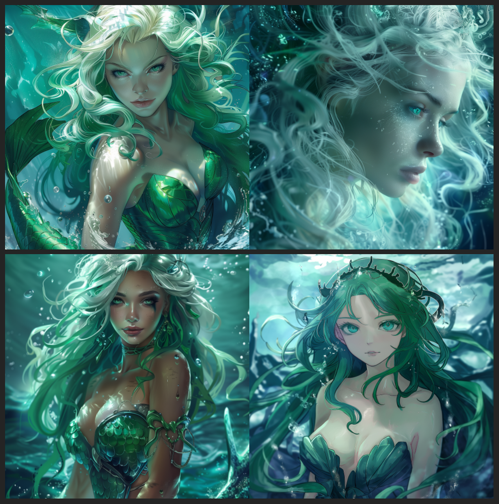

# siren-cz

# Projekt Siréna (Siren) - Specifikace

## Úvod

Projekt **Siren** je navržen jako pokročilá umělá inteligence (AI), podobná Jarvisovi z Marvel Universe, avšak primárně implementovaná jako lokální jazykový model (LLM). Tento projekt kombinuje vysokou úroveň autonomie s možností integrace cloudových zdrojů pro zpracování náročnějších úkolů prostřednictvím API OpenAI/Gemini. Hlavním cílem je poskytnout uživatelům unikátní nástroj pro interakci s operačním systémem a aplikacemi, rozšiřující možnosti současné technologie umělé inteligence.

## Klíčové Komponenty

### Lokální a cloudové zpracování

Siren využívá lokálně běžící LLM z HuggingFace, který je speciálně dotrénovaný pro konkrétní použití, což zajišťuje rychlé a efektivní reakce na většinu dotazů a úkolů. Pro složitější operace, které přesahují kapacity lokálního zpracování, je Siren schopna využít cloudové zpracování prostřednictvím integrace s API OpenAI/Gemini.

### Pokročilé skriptování a interakce se souborovým systémem

Siren má schopnost vykonávat přesně definované skripty, umožňující pokročilou manipulaci se souborovým systémem a linuxovými službami. To zahrnuje, ale není omezeno na, správu souborů, automatizaci úloh a integraci s různými aplikacemi.

### Data embedding a rozšíření vstupních dat

Projekt umožňuje integraci a správu adresářů a souborů pod správou Siren, což rozšiřuje její schopnost zpracovávat a reagovat na dotazy týkající se obsahu těchto souborů. To otevírá možnosti pro spolupráci na dokumentech, vyhledávání informací a další interakce s daty.

### Moduly pro vytváření a spouštění vlastních skriptů

Siren nabízí nástroje pro tvorbu a spouštění uživatelsky definovaných skriptů s konkrétními oprávněními, čímž umožňuje automatizaci široké škály úkolů na uživatelově počítači.

### Komunikace a interakce

- **Text-to-Speech (TTS):** Siren může komunikovat s uživateli prostřednictvím řeči, což umožňuje plynulou interakci bez nutnosti fyzického zadávání příkazů.
- **Integrace s Domácími Systémy:** Možnost napojení na domácí chytrou domácnost a další systémy prostřednictvím API a skriptů rozšiřuje využití Siren v každodenním životě.

### Rozhraní a přístup

Siren bude přístupná prostřednictvím několika rozhraní:
- **Příkazová řádka Linuxu:** Pro pokročilé uživatele a automatizaci.
- **Web-GUI ve formě chatu:** Pro snadnou a intuitivní interakci s AI.
- **Speech-to-Text:** Pro budoucí rozvoj a ještě přirozenější interakci s uživateli.

### Bezpečnost a Autorizace

Bezpečnostní opatření a authentikační modul zajistí, že kritické operace budou vyžadovat ověření, aby se předešlo neoprávněné manipulaci s AI. Uživatelé budou mít kontrolu nad tím, zda se má pro pokročilé analýzy využít externí cloudové zpracování.

## Závěr

Projekt Siren přináší vizi pokročilé AI, která je nejen schopna autonomního lokálního zpracování, ale také se integruje s cloudovými službami pro rozšířené analýzy a úkoly. S flexibilitou v tvorbě a spouštění skriptů, rozšířenou interaktivitou a důrazem na bezpečnost, Siren slibuje revoluční přístup k osobní a profesionální produktivitě.

# Design

## Siren Logo

    
    
    
    

## Resources

* RealtimeTTS processing: https://github.com/KoljaB/RealtimeTTS
* LLM CLI+python: https://github.com/simonw/llm
* LLM API 2: https://github.com/1b5d/llm-api
* REST-GPT: https://restgpt.github.io/
* REST API 2: https://www.youtube.com/watch?v=HI3cYN0c9ZU, https://www.youtube.com/watch?v=2Qldg68CL_M

